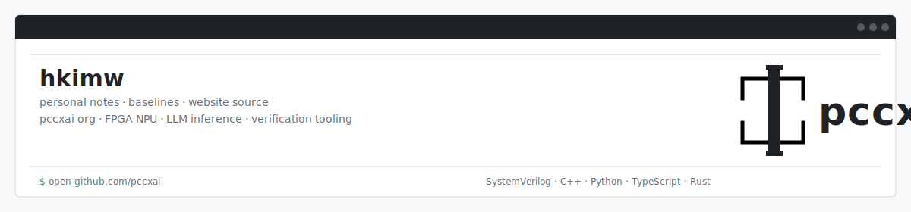

<div align="center">

<a href="https://hkimw.github.io/hkimw/">
  
</a>

<br/>

<a href="https://hkimw.github.io/hkimw/">
  
</a>
<a href="https://hkimw.github.io/hkimw/projects">
  
</a>
<a href="https://hkimw.github.io/hkimw/blog">
  
</a>

<br/><br/>

<a href="https://github.com/hkimw">
  
</a>
<a href="https://github.com/hkimw">
  
</a>

</div>

---

## What I work on

| Area | Focus |
|---|---|
| **AI Hardware** | FPGA NPU, systolic array datapaths, custom ISA, memory hierarchy |
| **LLM Inference** | Transformer decode bottlenecks, KV-cache, GEMM/GEMV, quantization |
| **Systems** | C/C++, Python runtimes, queues, profiling, reproducible benchmarks |
| **Research Writing** | Paper notes, architecture diagrams, experiment logs, technical reports |

---

## Featured work

<table>
<tr>
<td width="50%" valign="top">

#### [pccx-FPGA-NPU-LLM-kv260](https://github.com/hkimw/pccx-FPGA-NPU-LLM-kv260)

INT4 quantized FPGA NPU for LLM inference on Xilinx KV260.

<a href="https://github.com/hkimw/pccx-FPGA-NPU-LLM-kv260/stargazers"></a>
<a href="https://github.com/hkimw/pccx-FPGA-NPU-LLM-kv260/network/members"></a>
<a href="https://github.com/hkimw/pccx-FPGA-NPU-LLM-kv260/issues"></a>
<a href="https://github.com/hkimw/pccx-FPGA-NPU-LLM-kv260/commits"></a>

</td>
<td width="50%" valign="top">

#### [llm-lite](https://github.com/hkimw/llm-lite)

Lightweight LLM inference engine with INT4 / INT16 quantization.

<a href="https://github.com/hkimw/llm-lite/stargazers"></a>
<a href="https://github.com/hkimw/llm-lite/network/members"></a>
<a href="https://github.com/hkimw/llm-lite/issues"></a>
<a href="https://github.com/hkimw/llm-lite/commits"></a>

</td>
</tr>
<tr>
<td width="50%" valign="top">

#### [pccx-lab](https://github.com/hkimw/pccx-lab)

Tauri + React inference visualization and trace inspector.

<a href="https://github.com/hkimw/pccx-lab/stargazers"></a>
<a href="https://github.com/hkimw/pccx-lab/network/members"></a>
<a href="https://github.com/hkimw/pccx-lab/issues"></a>
<a href="https://github.com/hkimw/pccx-lab/commits"></a>

</td>
<td width="50%" valign="top">

#### [pccx](https://github.com/hkimw/pccx)

Research notebook and ISA documentation for the pccx project family.

<a href="https://github.com/hkimw/pccx/stargazers"></a>
<a href="https://github.com/hkimw/pccx/network/members"></a>
<a href="https://github.com/hkimw/pccx/issues"></a>
<a href="https://github.com/hkimw/pccx/commits"></a>

</td>
</tr>
</table>

---

## Current direction

> I am building a research-oriented AI systems portfolio around **edge LLM inference**, where model graphs meet memory bandwidth, runtime queues, quantization, and hardware limits.

- Main stack: **SystemVerilog / FPGA / C++ / Python / TypeScript**
- Main research theme: **memory-bound Transformer inference**
- Main project family: **pccx / pccx-lab / llm-lite**
- Homepage: **technical notebook + project portfolio + paper notes**

---

## Tech stack

<p>
  
  
  
  
  
  
</p>

---

<details>
<summary><b>About this website repository</b></summary>

This repository also contains my personal website and research notebook, built with Docusaurus and customized as a quiet, text-first engineer notebook.

```bash
npm run start
npm run build
```

The website is used as a technical portfolio for AI systems, FPGA acceleration, LLM inference experiments, research notes, and project documentation.

</details>
