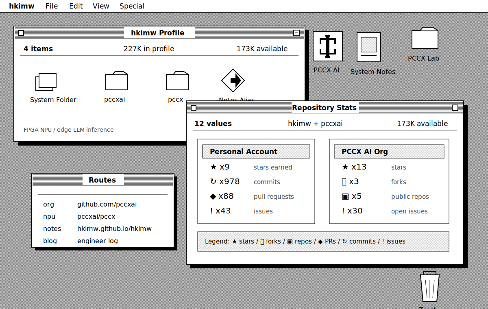

<p align="center">
  
</p>

<p align="center">
  <a href="https://github.com/pccxai"></a>
  <a href="https://github.com/pccxai/pccx"></a>
  <a href="https://hkimw.github.io/hkimw/"></a>
  <a href="https://hkimw.github.io/hkimw/blog"></a>
</p>

| SCOPE | STARS | FORKS / REPOS | PRS / COMMITS | ISSUES |
|---|---:|---:|---:|---:|
| [hkimw](https://github.com/hkimw) | 9 earned | 5 repos | 88 PRs / 978 commits | 43 |
| [pccxai](https://github.com/pccxai) | 13 | 3 forks / 5 repos | project family | 30 open |

<details>
<summary><b>PERSONAL_FEATURED_WORK</b></summary>

<br/>

<table>
<tr>
<td width="50%" valign="top">

#### [llm-bottleneck-lab](https://github.com/hkimw/llm-bottleneck-lab)

Software baseline for LLM inference bottleneck analysis before ideas move into PCCX.

<a href="https://github.com/hkimw/llm-bottleneck-lab/stargazers"></a>
<a href="https://github.com/hkimw/llm-bottleneck-lab/network/members"></a>
<a href="https://github.com/hkimw/llm-bottleneck-lab/issues"></a>
<a href="https://github.com/hkimw/llm-bottleneck-lab/commits"></a>

</td>
<td width="50%" valign="top">

#### [hkimw](https://github.com/hkimw/hkimw)

Docusaurus technical notebook, project portfolio, paper notes, and website source.

<a href="https://github.com/hkimw/hkimw/stargazers"></a>
<a href="https://github.com/hkimw/hkimw/network/members"></a>
<a href="https://github.com/hkimw/hkimw/issues"></a>
<a href="https://github.com/hkimw/hkimw/commits"></a>

</td>
</tr>
<tr>
<td width="50%" valign="top">

#### [Driver-drowsiness-detection](https://github.com/hkimw/Driver-drowsiness-detection)

Undergraduate latency-focused computer vision project using facial landmarks and a small model.

<a href="https://github.com/hkimw/Driver-drowsiness-detection/stargazers"></a>
<a href="https://github.com/hkimw/Driver-drowsiness-detection/network/members"></a>
<a href="https://github.com/hkimw/Driver-drowsiness-detection/issues"></a>
<a href="https://github.com/hkimw/Driver-drowsiness-detection/commits"></a>

</td>
<td width="50%" valign="top">

#### [Technical notebook](https://hkimw.github.io/hkimw/)

Public-facing writing space for architecture notes, experiments, paper reviews, and current work.

<a href="https://hkimw.github.io/hkimw/"></a>
<a href="https://hkimw.github.io/hkimw/blog"></a>

</td>
</tr>
</table>

</details>

<details>
<summary><b>PCCX_AI_FEATURED_WORK</b></summary>

<br/>

<table>
<tr>
<td width="50%" valign="top">

#### [pccx-FPGA-NPU-LLM-kv260](https://github.com/pccxai/pccx-FPGA-NPU-LLM-kv260)

Bare-metal FPGA implementation of the PCCX NPU for LLM inference on Kria KV260.

<a href="https://github.com/pccxai/pccx-FPGA-NPU-LLM-kv260/stargazers"></a>
<a href="https://github.com/pccxai/pccx-FPGA-NPU-LLM-kv260/network/members"></a>
<a href="https://github.com/pccxai/pccx-FPGA-NPU-LLM-kv260/issues"></a>
<a href="https://github.com/pccxai/pccx-FPGA-NPU-LLM-kv260/commits"></a>

</td>
<td width="50%" valign="top">

#### [pccx](https://github.com/pccxai/pccx)

Open NPU architecture for memory-bound Transformer inference on edge FPGAs.

<a href="https://github.com/pccxai/pccx/stargazers"></a>
<a href="https://github.com/pccxai/pccx/network/members"></a>
<a href="https://github.com/pccxai/pccx/issues"></a>
<a href="https://github.com/pccxai/pccx/commits"></a>

</td>
</tr>
<tr>
<td width="50%" valign="top">

#### [pccx-lab](https://github.com/pccxai/pccx-lab)

Visual pre-RTL bottleneck profiler, trace reports, and verification tooling for PCCX.

<a href="https://github.com/pccxai/pccx-lab/stargazers"></a>
<a href="https://github.com/pccxai/pccx-lab/network/members"></a>
<a href="https://github.com/pccxai/pccx-lab/issues"></a>
<a href="https://github.com/pccxai/pccx-lab/commits"></a>

</td>
<td width="50%" valign="top">

#### [pccxai](https://github.com/pccxai/pccxai)

Organization profile and public landing repository for the PCCX AI project family.

<a href="https://github.com/pccxai/pccxai/stargazers"></a>
<a href="https://github.com/pccxai/pccxai/network/members"></a>
<a href="https://github.com/pccxai/pccxai/issues"></a>
<a href="https://github.com/pccxai/pccxai/commits"></a>

</td>
</tr>
</table>

</details>

## SYSTEM_NOTES

| FIELD | VALUE |
|---|---|
| MAIN_STACK | SystemVerilog / FPGA / C++ / Python / TypeScript / Rust |
| RESEARCH_THEME | Memory-bound Transformer inference |
| PROJECT_FAMILY | [pccxai](https://github.com/pccxai) / [pccx](https://github.com/pccxai/pccx) / [pccx-lab](https://github.com/pccxai/pccx-lab) |
| SITE | [technical notebook + project portfolio](https://hkimw.github.io/hkimw/) |

<details>
<summary><b>REPOSITORY_COMMANDS</b></summary>

```bash
npm run start
npm run build
npm run readme:pccx-stats
```

</details>
