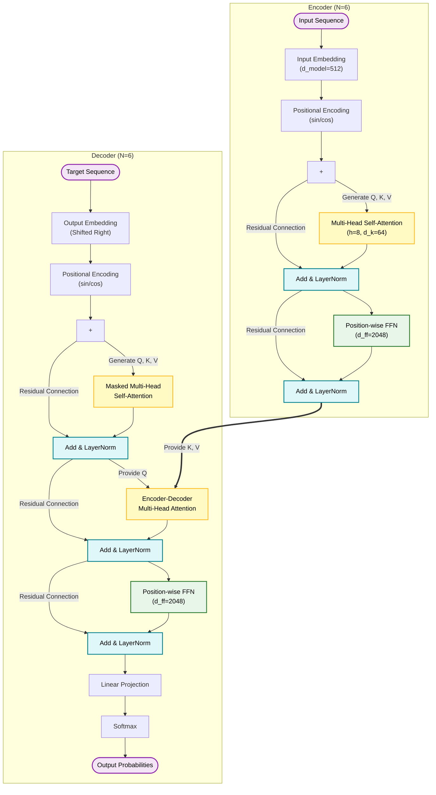
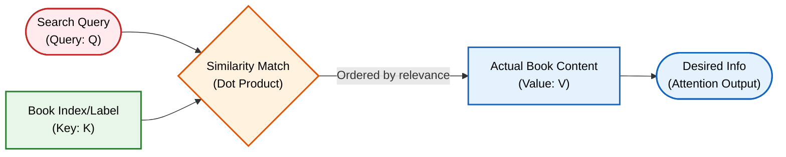
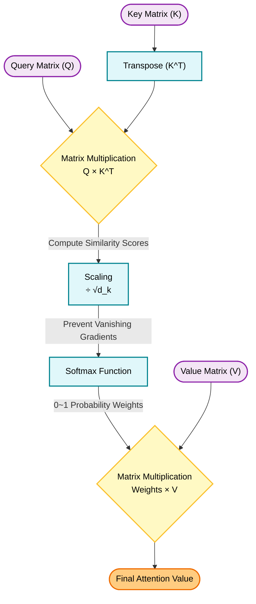
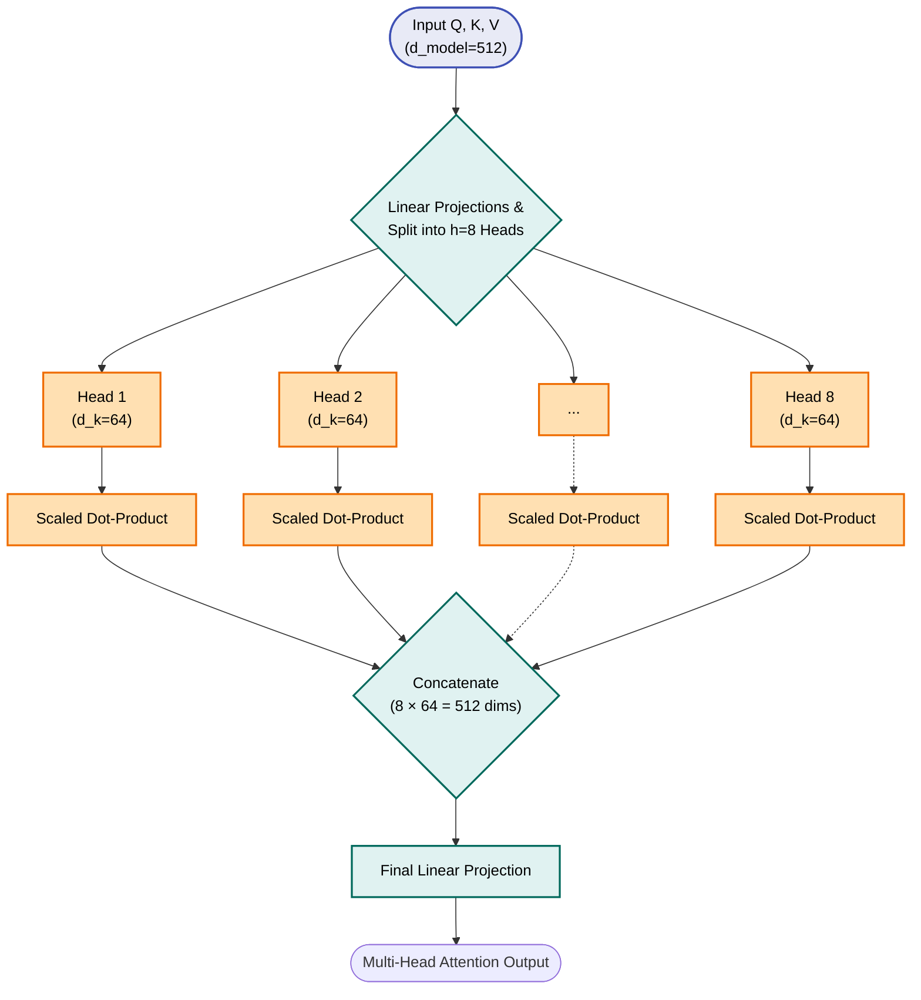
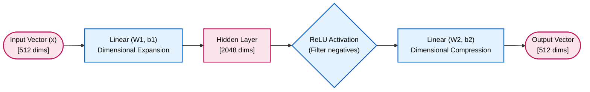
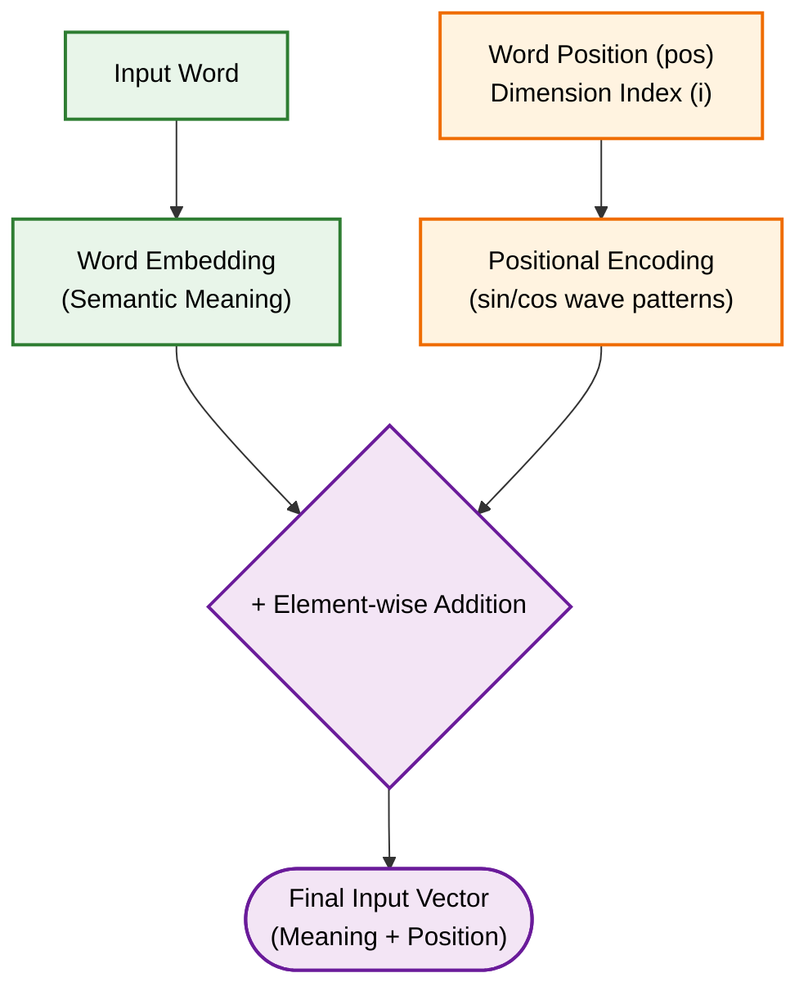

This text contains the core concepts and mathematical principles of the Transformer model architecture.

<!-- truncate -->

## 1. Background of the Transformer's Emergence

The mainstream models in the existing NLP field were RNNs (Recurrent Neural Networks) and LSTMs (Long Short-Term Memory). These models process data sequentially. For example, given the sentence "I go to school," it processes "I", then uses that result to process "go to," and uses that result again to process "school."

This sequential processing approach has two critical limitations:

1. **Inability to process in parallel:** The computation for the next word can only be performed after the computation for the previous word is finished, making it impossible to utilize the computer's computational resources simultaneously for parallel processing.

2. **Long-term Dependency problem:** As the sentence gets longer, the information of words inputted early on tends to fade as it progresses towards the end.

The Transformer originated from the idea: "Instead of inputting words sequentially, let's **input the entire sentence at once** and **calculate the relationships between words simultaneously**." The core technology that made this possible is the **Attention** mechanism.

## 2. Model Architecture

The Transformer adopts an **Encoder-Decoder** structure optimized for Sequence Transduction tasks like machine translation.

* **Auto-regressive property:** When generating an output, the model uses the previously generated output symbols as additional input for the next step. In other words, it predicts the 1st word, and then predicts the 2nd word by including that 1st word.

### 2.1 Encoder

The Encoder reads the inputted original sentence (e.g., a Korean sentence) and comprehends the meanings and context of the words within it, transforming it into compressed information (Representation).

* **Layer structure:** It consists of a stack of $N = 6$ identical layers.

* **Sub-layer:** Each layer internally has two sub-layers.

  1. **Multi-Head Self-Attention:** It determines how the words within the sentence relate to one another.

  2. **Position-wise Feed-Forward Network (FFN):** A Neural Network that deeply learns the features of each word based on the identified relationship information.

* **Residual Connection and Layer Normalization:**
  The output of each sub-layer is processed with the following formula:

  $$
  Output = LayerNorm(x + Sublayer(x))
  $$

  * $x$**:** The original input value entering the sub-layer.

  * $Sublayer(x)$**:** The resulting value after going through the Attention or FFN computation.

  * $x + Sublayer(x)$ **(Residual Connection):** The original input value is added to the computation result. This prevents the loss of initial information even as the layers get deeper, stabilizing the training.

  * $LayerNorm(...)$**:** Calculates the mean and variance of the added result to normalize the data into a consistent range.

* **Dimensionality unification:** To facilitate the Residual Connection smoothly, the output dimensions of all sub-layers and Embedding layers within the model are fixed at $d_{model} = 512$.

### 2.2 Decoder

The Decoder generates the target sentence (e.g., a translated English sentence) one by one, based on the context information compressed by the Encoder. Like the Encoder, it consists of $N = 6$ identical layers, but the number of sub-layers increases to 3.

1. **Masked Multi-Head Self-Attention:**

   * When the Decoder generates an output word, it acts to mask the words that are behind(in the future) the current position (in the future) so they cannot be seen in advance.

   * For example, when predicting the 3rd word, it masks the similarity scores of future words with $-\infty$ so that only the 1st and 2nd words can be referenced, making the Attention weight 0 after passing through the Softmax function.

2. **Multi-Head Attention (Encoder-Decoder Attention):**

   * This is where the Decoder decides "which part of the original sentence to focus on" to generate a word.

   * Here, the Decoder uses its own information as the standard (Query) and references the information (Key, Value) finally outputted by the Encoder.

3. **Position-wise Feed-Forward Network:** Identical to the Encoder's structure.

## 3. Attention Mechanism

The Attention mechanism is the core of the Transformer. The Attention function can be described as mapping a Query and a set of Key-Value pairs to an output.

To use an analogy, it is like the process of finding information in a library.

* **Query (Q):** The 'search term' entered by the user in the search bar (the target word currently being analyzed).

* **Key (K):** The 'index' or 'label' attached to the books in the library (features possessed by other words).

* **Value (V):** The actual 'content' of that book (the actual information possessed by other words).

(* In the case of Self-Attention, $Q$, $K$, and $V$ are all generated from the same input sentence, each transformed for its specific purpose by multiplying different weight matrices.)

### 3.1 Scaled Dot-Product Attention

The paper proposes a method called 'Scaled Dot-Product Attention' to compute attention. The computation formula is as follows:

$$
Attention(Q, K, V) = softmax(\frac{QK^T}{\sqrt{d_k}})V
$$

* $Q$ **(Query Matrix):** | [Question] | A matrix gathering the vectors of the words currently being processed.

* $K$ **(Key Matrix):** | [Position] | A matrix gathering the vectors of words to be referenced.

* $V$ **(Value Matrix):** | [Content] | A matrix gathering the actual information vectors of words to be referenced.

* $K^T$**:** The Transposed Matrix of the Key Matrix. Its rows and columns are swapped for matrix multiplication.

* $d_k$**:** The dimensionality of the Query and Key vectors. (The paper uses $d_k = 64$.)

* $\sqrt{d_k}$**:** The square root of $d_k$. (In the paper, it becomes $\sqrt{64} = 8$.)

* $softmax$**:** A function that converts inputted values into probabilities between 0 and 1, ensuring their sum equals 1. (Formula: $\frac{e^{x_i}}{\sum e^{x_j}}$)

---

$$
Attention(Q, K, V) = softmax(\frac{QK^T}{\sqrt{d_k}})V
$$

1. $QK^T$ **(Similarity Calculation):** Performs Matrix Multiplication between the Query matrix and the transposed Key matrix. This is the process of computing the dot product between the Query word vector and each Key word vector at once, yielding a mathematical score of how highly related (similar) the Query word is to each key word. A larger value means a higher correlation between the two words.

2. $\frac{QK^T}{\sqrt{d_k}}$ **(Scaling):** When performing the dot product, the resulting values tend to grow very large as the dimensionality ($d_k$) increases. If the values become too large, the gradient approaches 0 in the subsequent Softmax function, causing an issue where learning does not progress. To prevent this, the scores are divided by $\sqrt{d_k}$ to appropriately adjust (Scale) the magnitude of the values.

3. $softmax(...)$ **(Weight Probabilization):** The scaled scores are passed through the Softmax function. Through this process, the score for each word is converted into a probability value (weight) between 0 and 1. For example, a result of "0.9" means it is very strongly associated with this word, while "0.01" means it can be largely ignored.

4. $\times V$ **(Combining Information):** The calculated Softmax weight is multiplied by the Value Matrix, which is the actual information. Consequently, a large amount of information (Value) from highly correlated words is retrieved, and a small amount of information from weakly correlated words is retrieved, merging them into one. This result becomes the final output of Attention.

### 3.2 Multi-Head Attention

The Transformer does not perform the above single Attention just once; it splits the dimensions into multiple parts and performs several Attentions in parallel. This is called Multi-Head Attention.

In the paper, the $d_{model} = 512$ dimension is split into $h = 8$ Heads. Therefore, each Head handles a vector of $d_k = d_v = 512 / 8 = 64$ dimensions.

**Why use Multi-Head (Multiple)?**

The relationships between words in a sentence can be interpreted from multiple angles.
For example, in the sentence "He kicked the ball hard," the word 'kicked' could be connected to 'He' (Subject, who did it?) or connected to 'ball' (Object, what was done?).
Using a single Attention only allows looking at an average perspective among various relationships, but dividing into 8 Heads enables each Head to simultaneously capture different and diverse contextual features (Representation subspaces), such as relationships with the subject, the object, and the tense.

The 8 resulting matrices calculated from each Head are concatenated together at the end, and then multiplied by a Linear Projection matrix to become the final output matrix.

## 4. Position-wise Feed-Forward Network

The data that has passed through the Attention sub-layer goes through a Fully Connected Feed-Forward Network (FFN) included in each layer.

"Position-wise" means that the exact same Neural Network is applied independently to each individual word position that makes up the sentence.

$$
FFN(x) = \max(0, xW_1 + b_1)W_2 + b_2
$$

* $x$**:** The input vector that has passed through the Attention layer. The dimension is $d_{model} = 512$.

* $W_1, b_1$**:** The weight matrix and bias vector for the first linear transformation.

* $\max(0, ...)$**:** The ReLU (Rectified Linear Unit) activation function. If the calculation result inside the parenthesis is less than 0, it becomes 0; if it is greater than 0, the value is maintained. This is a core element that imparts non-linearity.

* $W_2, b_2$**:** The weight matrix and bias vector for the second linear transformation.

This neural network has a sandwich structure.

1. **Dimension Expansion:** The input vector $x$ (512 dimensions) is multiplied by the weight $W_1$ to greatly expand the dimension to $d_{ff} = 2048$ dimensions.

2. **Activation:** It passes through the ReLU function in the expanded space to extract the non-linear features of the data. In this process, unnecessary information (negative values) is eliminated as 0.

3. **Dimension Compression:** It is multiplied again by the weight $W_2$ to compress it back to the original dimension of $d_{model} = 512$ and outputted.

If Attention is the process of collecting 'relationships' between words, the FFN layer takes on the role of processing and remembering the 'meaning' of each word itself in a more complex and richer way based on the collected information. Most of the learning parameters (weights) of the entire model are concentrated in the $W_1, W_2$ matrices of this FFN.

## 5. Positional Encoding

The Transformer abandoned the RNN structure and opted for parallel processing through matrix multiplication. However, this creates a inherent limitation. Because the Attention operation treats a set of words like an unordered 'Bag of words', it can mathematically perceive "I eat rice" and "Rice eat I" as identical.

To solve this, the process of adding a vector containing position information to the inputted word's Embedding vector so the model can know the relative or absolute 'position (order)' information of words within a Sequence is called **Positional Encoding**.

The paper uses Sine and Cosine functions with various frequencies to generate position information.

$$
PE_{(pos, 2i)} = \sin(pos / 10000^{2i/d_{model}})
$$

$$
PE_{(pos, 2i+1)} = \cos(pos / 10000^{2i/d_{model}})
$$

* $pos$**:** The position index of the corresponding word within the sentence. (e.g., the first word is 0, the second word is 1)

* $i$**:** The dimension index. It indicates which position the value holds within the Embedding vector.
The range of $i$ is from $0$ to $d_{model}/2 - 1$, and through this, different trigonometric functions are paired and applied to the even index ($2i$) and odd index ($2i+1$) of the vector, respectively.

* $2i, 2i+1$**:** This means the sine (sin) function is used when the vector's index is even (2i), and the cosine (cos) function is used when it is odd (2i+1).

* $d_{model}$**:** The total dimensionality of the Embedding vector (512).

* $10000^{2i/d_{model}}$**:** The denominator term that determines the frequency. As the index $i$ increases, the denominator gets larger, causing the frequency to decrease, which makes the position values oscillate more slowly.

Using this formula generates continuous real numbers with a unique pattern for each position (pos) within the sentence and each dimension (i) of the vector. Because trigonometric functions are used, the values of the position vector constantly wave between -1 and 1.

This 512-dimension 'position vector' generated by a mathematical rule is simply added (+) to the original word's 'Embedding vector' right before the data enters the first layer of the Encoder or Decoder. Consequently, as the model progresses with learning, it can grasp not only the inherent meaning of the word but also the relative position by backtracking this trigonometric wave pattern, realizing, "Ah, this word is at the beginning of the sentence," or "That word is right in the next position."
