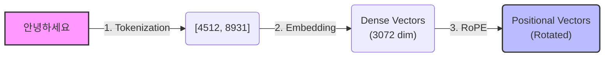
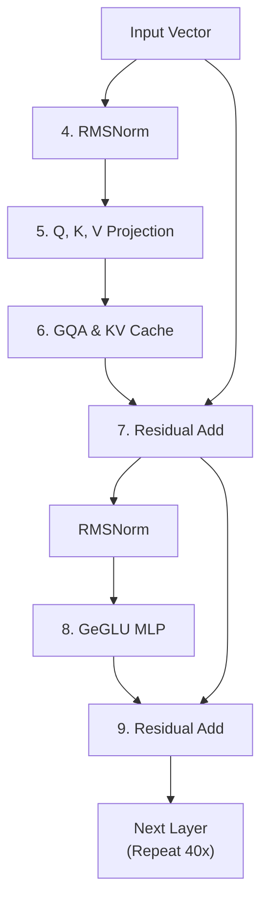
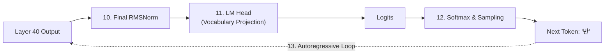

## Phase 1: 모델이 알아들을 수 있게 준비하기

<!-- truncate -->

**1단계: 토큰화 (Tokenization) - "단어 쪼개기"**
우리가 "안녕하세요"라고 치면, AI는 한글을 못 읽어. 그래서 자기가 아는 숫자(ID) 번호표로 바꿔야 해.
Gemma의 단어 사전(Vocabulary, 약 25만 개)을 뒤져서 쪼개는 거지.

- "안녕" -> 4512번
- "하세요" -> 8931번

이런 식으로 숫자로 쪼개. 이제 입력은 `[4512, 8931]` 이라는 두 개의 숫자가 돼.

수학적 표현:
문자열 $S$ 를 토큰 시퀀스 $X = \{x_1, x_2, \dots, x_N\}$ 으로 매핑하는 함수 $f_{tokenize}$ . 여기서 $x_i \in \{1, 2, \dots, V\}$ (단, $V$ 는 단어 사전의 크기, 약 256,000).

**2단계: 임베딩 (Embedding) - "숫자를 캐릭터 스탯창으로 만들기"**
숫자만 있으면 의미를 모르잖아? 4512번이라는 숫자를 엄청나게 긴 **숫자 배열(벡터)** 로 바꿔줘.
마치 게임 캐릭터 스탯창(힘, 민첩, 지능...)을 만드는 거랑 같아. Gemma 3 4B 기준으로는 이 스탯창이 약 3072칸(차원) 정도 될 거야.

- "안녕" -> `[0.1, -0.4, 0.8, ... (3072개)]`
- "하세요" -> `[-0.2, 0.5, 0.1, ... (3072개)]`

이제 단어가 수학적인 공간에 자리를 잡은 거야.

수학적 표현:
임베딩 행렬 $E \in \mathbb{R}^{V \times d_{model}}$ (단, $d_{model} = 3072$ ).
토큰 $x_i$ 에 대한 임베딩 벡터 $\mathbf{e}_i$ 는 행렬 $E$ 에서 $x_i$ 번째 행을 가져오는 것과 같음. (또는 원-핫 벡터 $\mathbf{v}_{x_i}$ 와의 행렬 곱: $\mathbf{e}_i = \mathbf{v}_{x_i} E$ ).
결과적으로 입력 시퀀스는 행렬 $\mathbf{X} \in \mathbb{R}^{N \times d_{model}}$ 이 됨.

**3단계: 위치 정보 추가 (RoPE) - "순서표 달아주기"**
단어 두 개가 들어왔는데, AI는 이게 "안녕 하세요"인지 "하세요 안녕"인지 순서를 몰라. 한꺼번에 처리하거든.
그래서 각 단어의 스탯창(벡터)을 수학적으로 살짝 회전(Rotation) 시켜줘.

- 1번 자리 "안녕"은 10도 회전
- 2번 자리 "하세요"는 20도 회전

이걸 **RoPE(Rotary Position Embedding)** 라고 해. 이제 AI는 단어의 순서를 알게 됐어.
1번 단어는 $1 \times \theta$ 만큼 회전, 2번 단어는 $2 \times \theta$ 만큼 회전... $n$ 번 단어는 $n \times \theta$ 만큼 회전.

이때 사용하는 것이 그 유명한 회전 행렬(Rotation Matrix)이야.

$$
\mathbf{R}_{n\theta} = \begin{bmatrix} \cos(n\theta) & -\sin(n\theta) \\ \sin(n\theta) & \cos(n\theta) \end{bmatrix}
$$

여기에 좌표 $(x,y)$ 를 곱하면 새로운 위치로 이동하게 돼.
두 단어 $m$ 번과 $n$ 번의 벡터를 내적(곱하기)하면, 신기하게도 절대적인 위치값은 사라지고 두 단어 사이의 거리 차이인 $(m-n)\theta$ 에 대한 정보만 남아.

$$
(\mathbf{R}_{m\theta} \mathbf{q})^T (\mathbf{R}_{n\theta} \mathbf{k}) = \mathbf{q}^T \mathbf{R}_{m\theta}^T \mathbf{R}_{n\theta} \mathbf{k} = \mathbf{q}^T \mathbf{R}_{(m-n)\theta} \mathbf{k}
$$

- 가까운 단어: 각도 차이가 작음 -> 연관성 높게 측정됨
- 먼 단어: 각도 차이가 큼 -> 연관성 낮게 측정됨

**무한한 확장성**: 번호표(Absolute) 방식은 학습 때 본 길이보다 길어지면 당황하지만, RoPE는 각도만 더 돌리면 되니 더 긴 문장(Context Window)을 읽는 데 유리해.
**복소수(Complex Number) 활용**: 실제 구현할 때는 Euler's formula ( $e^{i\theta}$ )를 이용해 복소수 평면에서 곱셈 한 번으로 회전을 끝내버려. 아주 빠르지.

---

## Phase 2: 진짜 생각하기 (Transformer Block 40번 반복)

자, 이제 이 스탯창들이 Gemma의 '뇌'에 해당하는 Transformer Layer를 통과해. 이 층이 보통 40개 정도 겹쳐 있어. 한 층을 지날 때마다 아래 과정이 똑같이 반복돼.

**4단계: RMSNorm - "데이터 크기 진정시키기"**
연산을 막 하다 보면 숫자가 너무 커지거나 작아져서 에러가 날 수 있어. 그래서 데이터를 깔끔하게 평균 근처로 꾹꾹 눌러 담아주는 정규화(Normalization) 과정을 거쳐.

> **AI 심사위원이 가수 오디션을 심사할 때**
> A가수는 성량이 커서 매우 크게 들림(값: 100)
> B가수는 성량이 너무 작아서 모기 소리 수준임(값: 1)
> 이때 RMS Norm 투입 -> 가수들이 내는 평균적인 에너지를 측정(제곱해서 루트를 씌운 ‘실효값’)
> 계산된 평균 에너지로 각 가수들의 성량(값)을 나눠버림
> A가수는 값이(볼륨이) 줄고, B가수는 값이(볼륨이) 상대적으로 커짐
> = 평준화 됨 = 가수들의 목소리가 비슷한 크기(표준적인 범위)로 들리게 됨.

따라서 AI는 목소리 크기 상관없이 가창력에만 집중 가능해. (Layer Norm은 연산이 복잡하지만, RMS Norm은 분산 대신 제곱평균만 활용하여 빠르고 가벼운 연산이야).

수학적 표현:
입력 벡터 $\mathbf{x} \in \mathbb{R}^d$ 에 대해,

$$
\text{RMS}(\mathbf{x}) = \sqrt{\frac{1}{d} \sum_{i=1}^{d} x_i^2 + \epsilon}
$$

$$
\bar{\mathbf{x}} = \frac{\mathbf{x}}{\text{RMS}(\mathbf{x})} \odot \mathbf{\gamma}
$$

(여기서 $\epsilon$ 은 0으로 나누는 것을 방지하는 아주 작은 수, $\gamma$ 는 학습 가능한 스케일링 파라미터, $\odot$ 은 요소별 곱셈(Element-wise multiplication)을 의미함.)

**5단계: Q, K, V 만들기 - "질문, 힌트, 정답지"**
이제 각 단어("안녕", "하세요")가 3개의 분신을 만들어.

- **Q (Query, 질문)**: "내가 지금 누굴 찾아야 문맥이 맞지?"
- **K (Key, 힌트)**: "나는 이런 특징을 가진 단어야!"
- **V (Value, 내용)**: "나랑 연결되면 이 정보를 가져가!"

수학적 표현:
정규화된 입력 $\bar{\mathbf{X}}$ 에 가중치 행렬을 곱함.

$$
\mathbf{Q} = \bar{\mathbf{X}} \mathbf{W}_Q, \quad \mathbf{K} = \bar{\mathbf{X}} \mathbf{W}_K, \quad \mathbf{V} = \bar{\mathbf{X}} \mathbf{W}_V
$$

(하드웨어에서는 이 부분이 거대한 Matrix Multiplication(GEMM) 엔진에서 처리됨.)

**6단계: GQA와 KV Cache 연산 (여기서 NPU가 피똥 쌈)**
이 부분이 하드웨어 가속기(NPU) 설계할 때 가장 핵심인 부분이야.

**6-1) KV Cache (기억하기)**: AI가 문장을 한 글자씩 생성할 때, 처음부터 다시 다 계산하면 비효율적이야.
- **문제 상황**: "안녕", "하", "세"까지 만들고 "요"를 만들 차례라고 해보자. 원래대로라면 앞의 단어들을 처음부터 다시 다 계산해서 Q, K, V를 만들어야 해.
- **해결책 (KV Cache)**: "어차피 앞에 단어들은 안 변하잖아?" 이미 계산한 **K(힌트)** 와 **V(내용)** 를 **메모리(VRAM)** 에 딱 저장해두는 거지.

**NPU가 피똥 싸는 이유**:
- **메모리 점유**: 문장이 길어질수록 저장해야 할 K, V 값이 기하급수적으로 늘어나.
- **데이터 이동**: 대용량의 캐시 데이터를 외부 메모리에서 NPU 코어로 계속 왔다 갔다 옮기는 과정에서 **Memory Bound(병목 현상)** 가 발생해.

수학적 표현:
시점 $t$ 에서 새로 들어온 토큰의 $\mathbf{k}_t, \mathbf{v}_t$ 를 기존 캐시에 결합(Concatenate).

$$
\mathbf{K}^{(t)} = [\mathbf{K}^{(t-1)}, \mathbf{k}_t], \quad \mathbf{V}^{(t)} = [\mathbf{V}^{(t-1)}, \mathbf{v}_t]
$$

**6-2) GQA (그룹 지어서 찾기)**:
KV Cache가 메모리를 너무 많이 잡아먹다 보니, 이를 해결하기 위해 등장한 천재적인 설계가 **GQA(Grouped-Query Attention)** 야.

- **MHA (과거)**: 질문자(Q), 힌트(K), 내용(V)을 1:1:1로 가짐. 메모리가 터져나감.
- **GQA (현재 - Gemma 3 등)**: 질문자(Q)는 많지만, 힌트(K)와 내용(V)은 그룹을 지어 적게 만듦. (예: 4:1:1 대응)
- **효과**: "너네 질문자 4명은 이 힌트(K)랑 내용(V) 하나를 같이 써!"라고 지정해서 메모리에 저장해야 할 양을 확 줄여줘. 데이터 이동량이 줄어드니 추론 속도가 비약적으로 빨라지지.

"하세요"의 Q가 방금 저장된 "안녕"의 K를 훑어보고 연관성(Attention Score)을 계산해. 그리고 이 점수에 맞춰서 V를 섞어주면, "하세요"라는 벡터 안에 "안녕"이라는 문맥이 스며들게 돼.

수학적 표현 (Scaled Dot-Product Attention):
그룹 $g$ 에 속한 쿼리 헤드 $\mathbf{Q}_{i}$ 에 대해,

$$
\text{Score}_i = \frac{\mathbf{Q}_i (\mathbf{K}_g^{(t)})^T}{\sqrt{d_k}}
$$

$$
\text{Attention}_i = \text{Softmax}(\text{Score}_i + \text{Mask}) \mathbf{V}_g^{(t)}
$$

(하드웨어 관점: 여기서 Softmax 연산이 지수 함수( $e^x$ )와 나눗셈을 포함하므로, NPU에서 LUT(Look-Up Table)나 Taylor 전개 같은 근사(Approximation) 하드웨어 로직이 필수적으로 들어감.)

**7단계: Residual Connection (Add) - "원본 까먹지 않기"**
6단계에서 머리를 너무 굴리면 원래 단어의 본질을 잃어버릴 수 있어. 그래서 6단계의 결과물에 처음 들어왔던 3단계의 원본 데이터를 그대로 더해줘.

수학적 표현:

$$
\mathbf{X}_{out1} = \mathbf{X}_{in} + \text{Attention}(\text{RMSNorm}(\mathbf{X}_{in}))
$$

(하드웨어 관점: 행렬 덧셈. Element-wise 연산이므로 연산량 자체는 적지만 메모리에서 원본 $\mathbf{X}_{in}$ 을 유지해야 함.)

**8단계: MLP (다층 퍼셉트론) GeLU-Gate MLP - "의미 뻥튀기"**
이제 문맥을 파악했으니, 이 정보를 바탕으로 더 깊은 의미를 추론해.
"아, '안녕하세요'는 사람이 만났을 때 하는 인사말이네! 그럼 다음엔 호응하는 말이 나와야겠다!"

데이터 차원을 엄청나게 크게 늘렸다가 다시 원래 크기로 쪼그라뜨려. 이 과정에서 정보 필터링을 위해 GeGLU (Gated Linear Unit) 연산을 사용하지.

수학적 표현 (GeGLU):
먼저 $\mathbf{X}_{out1}$ 을 다시 RMSNorm 처리한 후, 두 개의 선형 변환을 거침.

$$
\mathbf{H}_{gate} = \text{GELU}(\bar{\mathbf{X}}_{out1} \mathbf{W}_{gate})
$$

$$
\mathbf{H}_{up} = \bar{\mathbf{X}}_{out1} \mathbf{W}_{up}
$$

$$
\mathbf{H}_{hidden} = \mathbf{H}_{gate} \odot \mathbf{H}_{up}
$$

최종적으로 원래 차원으로 복구:

$$
\text{MLP}_{\text{out}} = \mathbf{H}_{\text{hidden}} \mathbf{W}_{\text{down}}
$$

(하드웨어 관점: 가중치 행렬이 제일 큰 구간. Compute Bound가 심하게 발생하는 구간이므로, Systolic Array의 활용도를 극대화해야 하는 지점임.)

**9단계: Residual Connection (Add)**
마찬가지로 8단계 결과물에 7단계까지의 원본을 한 번 더 더해줘.

수학적 표현:

$$
\mathbf{X}_{out2} = \mathbf{X}_{out1} + \text{MLP}_{\text{out}}
$$

(여기까지가 1개의 Layer야. 이 4~9단계를 약 40번 반복하면서 데이터가 점점 고도화돼.)

---

## Phase 3: 대답 내놓기

**10단계: 최종 RMSNorm**
40번의 레이어를 뚫고 나온 최종 벡터를 마지막으로 깔끔하게 정돈해.

수학적 표현:

$$
\mathbf{X}_{final} = \text{RMSNorm}(\mathbf{X}_{layer40})
$$

**11단계: LM Head - "사전이랑 비교하기" (Output Projection)**
이 압축된 최종 벡터를 25만 개의 단어 사전이랑 쫙 비교(행렬 곱셈)해. 다음에 올 단어로 뭐가 제일 어울릴지 점수(Logits)를 매기는 거지.

수학적 표현:

$$
\mathbf{Logits} = \mathbf{X}_{final} \mathbf{W}_{vocab}^T \in \mathbb{R}^{V}
$$

**12단계: Softmax와 Sampling - "주사위 굴려서 단어 뽑기"**
점수를 확률(0~100%)로 바꿔.

- "반갑습니다" -> 85%
- "네" -> 10%
- "누구세요" -> 4%

여기서 확률에 따라 "반" 이라는 글자(토큰)가 딱! 뽑히는 거야.

수학적 표현:
온도(Temperature) $T$ 를 적용한 Softmax 연산:

$$
P(x_i) = \frac{\exp(\text{logit}_i / T)}{\sum_{j=1}^{V} \exp(\text{logit}_j / T)}
$$

---

## Phase 4: 무한 반복 (Autoregressive)

**13단계: 꼬리 물기 (KV Cache의 진가)**
대답이 끝난 게 아니야. 모델은 방금 자기가 뱉은 "반"을 다시 입력으로 집어넣어. (입력: "안녕하세요" + "반")

이때! "안녕하세요"는 아까 6단계에서 KV Cache에 저장해뒀지? 그래서 새로 들어온 "반"에 대한 Q, K, V만 계산해서 기존 캐시랑 비교하면 엄청 빠르게 다음 글자인 **"갑"** 을 뽑아낼 수 있어.

수학적 표현:

$$
P(\text{"갑"} | \text{"안녕", "하세요", "반"})
$$

이때 연산 복잡도는 $O(N)$ 에서 $O(1)$ 수준으로 떨어져.

**14단계: 끝날 때까지 반복**
이 과정을 계속 반복해.

- "안녕하세요 반 갑" -> "습"
- "안녕하세요 반갑 습" -> "니다"
- "안녕하세요 반갑습니다" -> "."
- "안녕하세요 반갑습니다." -> `<eos>` (End of Sequence, 대화 끝 토큰)

`<eos>` 토큰이 뽑히는 순간, 모델은 출력을 딱 멈춰. 이게 챗봇의 전체 생성 과정이야.
