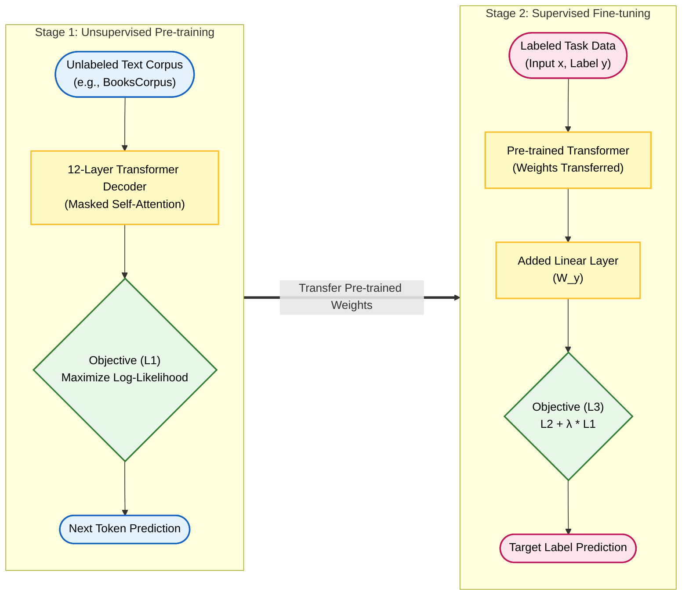
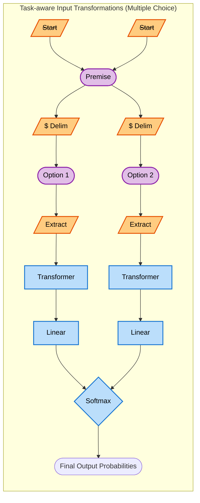
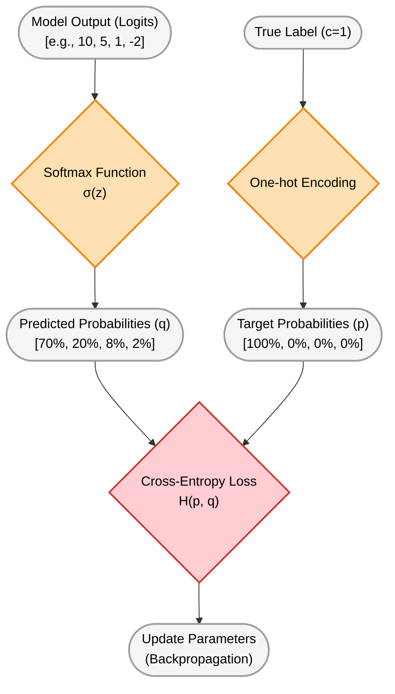

This document is a note organizing the architecture and training process of the GPT-1 paper by combining mathematical definitions with intuitive interpretations.

<!-- truncate -->

## 1. Core Fundamental Concepts of Language Models

### 1) Context Window

* **Definition**: Refers to the **maximum number of tokens** (sequence length $k$) that the model can process at one time. The computational complexity of the Transformer's Self-Attention operation is $O(k^2)$.

* **Intuitive Explanation**:
  * **Pros**: As the Context Window ($k$) gets larger, the model can remember words from the more distant past. With more hints available, the model can grasp the context more precisely and improve the accuracy of predicting the next word.
  * **Cons**: Transformers must calculate relationships (Attention) between all pairs of words. Therefore, if the context window becomes 10 times longer, the computational complexity (or cost) explodes quadratically (100 times). In short, increasing $k$ is a realistic barrier directly linked to hardware memory and training costs.

### 2) Maximize Likelihood

* **Definition**: A mathematical objective function that optimizes the model's internal parameters $\Theta$ to **Maximize** the conditional probability (**Likelihood**) that the actual ground-truth word will appear after a given context.

* **Intuitive Explanation**: Simply put, this is the fundamental "goal" that the language model learns. It is the process of constantly adjusting internal circuits (parameters) so that the word predicted by the model matches the word written in the actual text while reading massive amounts of text data.

## 2. GPT Backbone: Transformer Decoder

Originally, the Transformer published by Google consisted of an Encoder (understanding input) and a Decoder (generating output) for machine translation. However, GPT boldly discarded the Encoder and adopted a **structure consisting of a 12-layer Decoder stack**.

* **Why use only the Decoder?**
  The essence of GPT is **Next Token Prediction (Auto-regressive)**. Inside the Decoder, there is a core feature called **Masked Self-Attention**. This **Masking** prevents the model from seeing future words when processing the current word, effectively preventing "cheating." This structure aligns perfectly with GPT's philosophy of inferring the next step by looking only at the context from the past to the present.

## 3. GPT-1's Two-Stage Learning Pipeline

### Stage 1: Unsupervised Pre-training

This is the stage where the model learns the general patterns of language on its own through massive unlabeled text data.

* **Definition (Objective Function)**:
  Given a massive corpus of unlabeled tokens $\mathcal{U} = \{u_1, \dots, u_n\}$, the model is trained to maximize the following Log-Likelihood:

$$
L_1(\mathcal{U}) = \sum_i \log P(u_i | u_{i-k}, \dots, u_{i-1}; \Theta)
$$

  > When the model ($\Theta$) is shown previous words ($u_{i-k}, \dots, u_{i-1}$), it calculates the probability $P(\dots)$ of guessing the correct next word ($u_i$), and this value is summed ($\sum_i$) over all text data to get $L_1(\mathcal{U})$.

  * $L_1(\mathcal{U})$: 
      * Means the **Objective Function**.  
      Here, $\mathcal{U}$ is the massive unlabeled text Corpus used for training.  
      In other words, it is a score representing "how well the model understands (predicts) the data $\mathcal{U}$."
  
  * $\sum_i$:
      * Means to sum up the probability values below over the index $i$ of all words (tokens) in the sentences (data).

  * $\log$:
      * The Logarithm function. Probability values are decimals between 0 and 1, so multiplying probabilities of many words causes the number to converge to 0 (Underflow problem). Applying the log converts multiplication into addition ($\sum$), making it much better for computer calculation.

  * $P(\dots)$:
      * **Probability**. ($P$ = Conditional probability calculated by the Transformer Decoder with parameters $\Theta$).

  * $u_i$:
      * The **'current (next) word'** the model needs to guess.

  * $u_{i-k} ,…,u_{i−1}$:
      * The words that appeared before $u_i$. $k$ stands for the Context Window Size the model can see at once. In short, it is the **'context up to this point'**.
  
  * $\Theta$ (Theta):
      * The **parameters (weights) of the AI model** we want to train.
      
---

* **Intuitive Explanation**:

  * **Method**: The model reads massive texts scattered across the internet (news, books, wiki, etc.) in order and is made to guess the blank (next word).  
  (*Actually, the main corpus GPT-1 trained on is 'BooksCorpus', consisting of over 7,000 unpublished books. The nature of book data was very helpful in learning long-range dependencies.*)

  * **Why it is Unsupervised**: There is no need for humans to label the answer sheets one by one. The sentence "The capital of South Korea is [Seoul]" itself serves as both the question and the answer.

  * **Result**: Through this massive and simple "next word guessing game," the model learns grammar, common sense of the world, and contextual logic in their entirety.

### Stage 2: Supervised Fine-tuning

After pre-training is complete, this is the stage where the model is tuned to fit the specific problem we actually want to solve (sentiment analysis, multiple choice, etc.). Since it uses data with answers, it becomes Supervised Learning.

* **Definition (Objective Function)**:
  Given an input sequence $x^1, \dots, x^m$ from a labeled dataset $\mathcal{C}$ and a label $y$, the prediction probability and objective function are as follows:

---
### Label (Answer) Prediction Probability

$$
P(y | x^1, \dots, x^m) = \text{softmax}(h_l^m W_y)
$$

* $x^1, \dots, x^m$: 
    * The input sentence (data). Consists of $m$ words (tokens). (e.g., "This movie is so fun")  

* $y$: 
    * The target label we need to predict. (e.g., Positive or Negative)  

* $h_l^m$: 
    * The **final output value (Hidden state)** produced by processing the very last word ($m$) in the last layer ($l$) of the pre-trained Transformer model. You can think of it as the **'core meaning of the sentence'** summarized by the model after reading the entire sentence from start to finish.  

* $W_y$: 
    * The weights of the Linear Layer newly added to perform a specific task (classification). It receives the model's summary ($h_l^m$) and converts it into scores corresponding to the number of answer labels.  

* $\text{softmax}$: 
    * The Softmax function. It beautifully converts the raw scores from $W_y$ into probability values that sum up to 1 (100%). (e.g., Probability of Positive 0.9, Negative 0.1)  

---
### Fine-Tuning Objective Function

$$
L_2(\mathcal{C}) = \sum_{(x,y)} \log P(y | x^1, \dots, x^m)
$$

* $L_2(\mathcal{C})$:
    * The objective function of the second learning stage (Fine-tuning). $\mathcal{C}$ refers to the labeled dataset where humans have directly attached answers ($y$) (e.g., review-star rating data).
* $\sum_{(x,y)}$:
    * Means to sum all the probabilities below for every (input sentence $x$, answer $y$) pair in the dataset $\mathcal{C}$.
* $\log P(\dots)$:
    * The value obtained by applying the log to the probability that the model guesses the real answer $y$.

($h_l^m$ is the final activation vector of the Transformer's last block, and $W_y$ is the weight matrix of the output layer.)  

---
* **Utilization of Auxiliary Objective**:
  To improve training stability and convergence speed even in the supervised learning stage, GPT-1 additionally uses the language modeling (next word prediction) objective function from Stage 1 as an auxiliary.
  
$$
L_3(\mathcal{C}) = L_2(\mathcal{C}) + \lambda \cdot L_1(\mathcal{C})
$$

* $L_3(\mathcal{C})$:
    * The comprehensive goal score the model must finally maximize in the Fine-Tuning stage.
* $L_2(\mathcal{C})$:
    * The score for 'guessing the answer (label)' explained previously. (Supervised Learning)
* $L_1(\mathcal{C})$:
    * The score for 'guessing the next word' explained at the very beginning. (The method used in pre-training) However, here it predicts the next word using the text from the currently training labeled dataset ($\mathcal{C}$), not the massive internet data ($\mathcal{U}$).
* $\lambda$ (lambda):
    * A number controlling the **Weight**. It is a control dial that decides "Guessing the answer ($L_2$) is the main mission, but at what values should we mix in guessing the next word ($L_1$)?" (Usually, a value like 0.5 is used).  

**<h3>Why bring back the finished $L_1$ and add it?</h3>**

>**Improving Generalization (Preventing Overfitting):**  
If the model focuses only on guessing the answer (label), it might forget the true meaning of the text and only learn shallow tricks (e.g., unconditionally picking 'Positive' if a certain word appears). Making it continue to predict the next word forces it to maintain the ability to deeply understand context.

>**Increasing Learning Speed (Faster Convergence):**  
Since it learns while continuing to recognize the structure of language, the speed at which the model finds the answer becomes much faster.

>**Retaining Pre-trained Knowledge:**  
It prevents the phenomenon where the smart brain (weights), built with hard work by reading the entire internet, is lost (or destroyed) while learning only one specific task (**Catastrophic Forgetting**).

## 4. Task-aware Input Transformations

The core of this technique is **not altering the well-structured 12-layer decoder architecture**. Without changing the architecture, it performs various tasks by manipulating only the shape of the text input using special tokens.

### 1) The Role of Special Tokens

* **`<S> (Start)` token**: Attached to the front of the sequence, serving as an **Anchor** to signal the start of a new task.

  * *Difference from Positional Encoding*: While positional encoding informs the 'physical location' of a word, the `<S>` token is a 'structural initialization signal' indicating a new independent problem disconnected from the previous context. Without this token, the first word would have to perform both a semantic role and a structural role, causing an overload in attention computation.

* **`$ (Delim)` token**: Acts as a **separator** distinguishing different types of text, such as the premise and the hypothesis (options).

* **`<E> (Extract)` token**: A token attached to the very end of the sequence. When the decoder reaches this token, all previous context information has been calculated. In other words, it acts as a **Trigger to extract a single summary Vector** that compresses the meaning of the entire sentence.

### 2) Processing Mechanism for Multiple Choice Questions

This is the process assuming we are solving a multiple-choice question (1 premise, 4 options) like in the SATs.

1. **Batch Construction**: The 4 options are not bundled into one long text. Instead, independent sequences are constructed for the number of options as follows:

   * `<S> (Start)` + Premise + `$ (Delim)` + Option 1 + `<E> (Extract)`

   * `<S> (Start)` + Premise + `$ (Delim)` + Option 2 + `<E> (Extract)` (Same for the rest)

2. **Parallel Operation**: These 4 independent sequences are bundled into a batch and passed through the model at once.

3. **Score Derivation**: The 4 vectors outputted by the `<E> (Extract)` token at the end of each sequence are passed through the same Linear Classifier to obtain 4 arbitrary scores (Logits), one for each option. These scores are then collected and passed through the Softmax function to derive the probability of the answer.

## 5. Mathematical Processing and Error Calculation (Completion of Learning)

This is the essential mathematical process to update (train) parameters by comparing the arbitrary scores spit out by the model with the actual answer.

### 1) Softmax Function

* **Definition**: Converts the arbitrary scores $z_i$ of each class outputted from the linear classifier into probability values.

$$
\sigma(\mathbf{z})_i = \frac{e^{z_i}}{\sum_{j=1}^{K} e^{z_j}}
$$

* **Intuitive Explanation**:
  The 4 scores coming out of the linear classifier (e.g., 10, 5, 1, -2) vary in scale. There are two reasons for using Softmax instead of simple comparison:

  1. **Probability Distribution Conversion**: Adjusts the ratio so that the sum of all scores becomes exactly 1 (100%) (where each value is $0 < \sigma < 1$). Because it uses the exponential function ($e$), it makes large values more certain and small values smaller, inducing the model to have confidence.

  2. **Differentiability**: To use Deep Learning backpropagation, the graph must be differentiable, and Softmax perfectly meets this mathematical condition.

### 2) One-hot Encoding

* **Definition**: The target probability distribution $p$ when the answer is class $c$ is as follows:

$$
p(i) = \begin{cases} 1 & \text{if } i = c \\ 0 & \text{if } i \neq c \end{cases}
$$

* **Intuitive Explanation**: For the computer to compare its predicted probability (70%, 20%, 8%, 2%) with the real answer, the answer must also be in a 'probability shape'. If the answer is number 2, it means assigning 100% (1.0) only to the second slot and 0% (0.0) to the rest, making it into the form `[0.0, 1.0, 0.0, 0.0]`.

### 3) Cross-Entropy Loss

* **Definition**: Measures the difference (Loss) between the model's predicted probability distribution $q$ and the actual answer distribution $p$.

$$
H(p, q) = -\sum_{x} p(x) \log q(x)
$$

When the answer is One-hot Encoded, the probability is calculated only for the actual answer class $c$.
As the probability $q(c)$ assigned by the model to the answer class gets closer to 1, the error (Loss) converges to 0, and if the probability is low, the error diverges to infinity.

* **Intuitive Explanation**:
  MSE (Mean Squared Error) is used for continuous numbers (regression) like predicting house prices. On the other hand, for multiple-choice or classification problems, **Cross-Entropy, which measures the distance between two probability distributions (Prediction vs. Answer)**, is much more suitable.
  The model calculates the error value between the predicted value (e.g., `[0.1, 0.7, 0.05, 0.15]`) and the answer (`[0, 1, 0, 0]`), and then modifies internal parameters in the direction of reducing this error, gradually increasing the accuracy rate.
