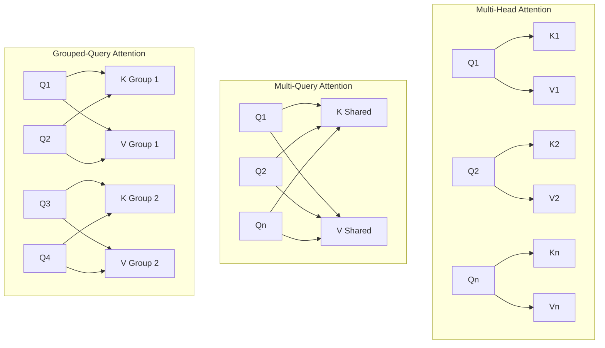

## 1. 인공지능이 텍스트를 처리하는 수학적 접근
인공지능 모델은 사람처럼 글자의 형태나 문장의 의미를 직관적으로 이해하지 못한다. 컴퓨터를 구성하는 프로세서는 오직 숫자만을 계산할 수 있는 물리적 장치이다. 따라서 인공지능이 문장을 처리하기 위해서는 가장 먼저 문장을 구성하는 모든 단어를 철저하게 수학적인 숫자의 배열로 변환하는 과정이 필요함.

<!-- truncate -->

사용자가 문장을 입력하면, 컴퓨터는 이 문장을 '토큰(Token)'이라는 아주 작은 단위로 쪼갠다. 하나의 토큰은 하나의 단어일 수도 있고, 단어의 일부분일 수도 있다. 컴퓨터는 이렇게 쪼개진 각각의 토큰에 대해 미리 학습된 긴 숫자의 목록을 할당한다. 이 숫자의 목록을 '임베딩(Embedding)' 또는 '벡터(Vector)'라고 부른다. 임베딩은 보통 수백 개에서 수천 개의 소수점 숫자로 이루어져 있으며, 이 숫자들은 해당 단어가 문법적으로 어떤 위치에 있는지, 다른 단어들과 함께 쓰일 때 어떤 패턴을 가지는지를 수학적 좌표로 나타낸 것이다.

그러나 단어 하나를 단순히 고정된 숫자 목록으로 바꾸는 것만으로는 문장 전체의 복잡한 의미를 파악할 수 없습니다. 문장 안에서 단어들은 서로에게 영향을 미치며 그 의미가 계속해서 변하기 때문이다. 컴퓨터가 이러한 단어들 사이의 관계를 파악하기 위해 사용하는 핵심적인 계산 과정이 바로 '어텐션(Attention)' 메커니즘이다.

어텐션 메커니즘은 문장 안의 모든 단어(토큰)들을 동시에 살펴보고, 현재 처리하고 있는 단어가 문장 내의 다른 모든 단어들과 수학적으로 얼마나 강력하게 연결되어 있는지를 '점수(Score)'로 계산하는 과정이다. 이 보고서에서는 초등학생과 중학생을 포함한 초보자들도 직관적으로 이해할 수 있도록, 어텐션 메커니즘을 구성하는 가장 기초적인 다중 헤드 어텐션(MHA)부터 속도를 개선한 다중 쿼리 어텐션(MQA), 그리고 최적의 균형을 찾은 그룹화 쿼리 어텐션(GQA)의 구조와 수학적 차이점을 비유 없이 숫자와 배열, 계산 과정 그 자체의 직관적인 단어만으로 아주 꼼꼼하게 설명한다.

---

## 2. 어텐션 연산의 세 가지 핵심 숫자 배열: Q, K, V
어텐션 메커니즘이 단어들 사이의 관계 점수를 계산하기 위해서는, 입력된 단어의 원래 숫자 배열(임베딩)을 그대로 사용하지 않습니다. 대신, 컴퓨터는 각 단어마다 세 가지의 완전히 새로운 숫자 배열을 만들어냅니다. 이 세 가지 숫자 배열을 각각 쿼리(Query,  $Q$ ), 키(Key,  $K$ ), 밸류(Value,  $V$ )라고 부른다. 이 세 가지 배열은 연산 과정에서 각기 다른 독립적인 역할을 수행한다.

### 2.1 쿼리(Query,  $Q$ ) 숫자 배열의 의미와 역할
수학 기호  $Q$ 로 표기되는 쿼리는, '현재 컴퓨터가 관계를 파악하고자 하는 기준 단어'가 다른 단어들로부터 어떤 정보를 얻어와야 하는지를 나타내는 숫자 배열이다.
컴퓨터가 문장을 왼쪽에서 오른쪽으로 순서대로 처리할 때, 현재 처리하고 있는 특정한 단어가 존재한다. 이 단어의  $Q$  숫자 배열 안에는 "나는 지금 문법적인 목적어를 나타내는 숫자를 찾고 있다"라거나 "나는 시간이나 장소를 나타내는 숫자를 찾고 있다"는 목적을 띠는 수학적 값들이 들어 있다. 즉,  $Q$ 는 문장 내의 다른 단어들과 곱해지기 위해 준비된 일종의 '탐색용 숫자 목록'이다.

### 2.2 키(Key,  $K$ ) 숫자 배열의 의미와 역할
수학 기호  $K$ 로 표기되는 키는, 문장 안에 있는 각 단어가 '자기 자신이 어떤 문법적 특징과 정보를 가지고 있는지'를 나타내는 숫자 배열이다.
 $Q$ 가 탐색을 위한 숫자 배열이라면,  $K$ 는 그 탐색의 대상이 되는 숫자 배열이다. 어텐션 계산 과정에서 기준 단어의  $Q$  숫자 배열은 문장 안에 있는 모든 단어들의  $K$  숫자 배열과 직접 수학적으로 곱해집니다. 곱셈 계산의 결과물이 큰 숫자로 나오면 두 단어의 관련도가 높다는 뜻이고, 작은 숫자나 음수로 나오면 관련도가 낮다는 뜻이다. 따라서  $K$ 는  $Q$ 와 상호작용하여 관련도 점수를 도출해내는 역할을 한다.

### 2.3 밸류(Value,  $V$ ) 숫자 배열의 의미와 역할
수학 기호  $V$ 로 표기되는 밸류는, 해당 단어가 실제로 다음 계산 단계로 넘겨줄 '진짜 알맹이 정보'를 담고 있는 숫자 배열이다.
앞서  $Q$ 와  $K$ 를 곱해서 두 단어 사이의 관련도 점수를 계산한다고 설명했습니다. 이 점수가 계산되고 나면, 컴퓨터는 그 점수(비율)만큼  $V$  숫자 배열에 들어있는 값들을 곱해서 가져옵니다. 만약 어떤 단어가 기준 단어와 관련도가 매우 높다고 점수가 나오면, 컴퓨터는 해당 단어의  $V$  숫자 배열에 있는 숫자들을 거의 그대로 복사해서 가져옵니다. 반대로 관련도 점수가 낮으면  $V$ 의 숫자들에 아주 작은 소수를 곱해서 거의 무시할 수 있는 수준의 숫자로 만들어 버립니다. 최종적으로  $Q$ 와  $K$ 는 점수를 계산하는 데 사용되고 소멸하며,  $V$  숫자 배열들만이 점수에 따라 섞여서 다음 단계로 전달됩니다.

---

## 3. 기호  $W_q, W_k, W_v$ 의 의미: 숫자 배열을 변환하는 가중치 행렬
컴퓨터는 원래 단어의 숫자 배열(임베딩)을 어떻게  $Q, K, V$ 라는 세 가지 서로 다른 숫자 배열로 나눌 수 있을까요? 이 변환 작업을 수행하는 수학적 도구가 바로 가중치 행렬(Weight Matrix)이며, 수학 기호로는  $W$ 를 사용한다.

### 3.1 가중치 행렬( $W$ )이란 무엇인가?
가중치 행렬은 수많은 숫자들을 가로와 세로로 반듯하게 줄지어 배치해 놓은 '거대한 숫자 표(Grid)'이다. 인공지능이 대규모 문서를 읽으며 학습(Training)을 진행할 때, 이 표 안에 들어있는 숫자들은 고정되어 있지 않고 끊임없이 변경됩니다. 정답에 가까운 결과를 내기 위해 표 안의 숫자 값들이 스스로 조금씩 커지거나 작아지는 과정을 거치는데, 이를 '학습 가능한 매개변수(Learnable Parameters)'라고 부른다.

어텐션 메커니즘에는 기본적으로 세 가지의 독립적인 가중치 행렬 표가 존재한다:
* **$W_q$** : 입력된 원래 단어의 숫자를  $Q$ (쿼리) 숫자 배열로 바꾸기 위해 사용되는 숫자 표이다.
* **$W_k$** : 입력된 원래 단어의 숫자를  $K$ (키) 숫자 배열로 바꾸기 위해 사용되는 숫자 표이다.
* **$W_v$** : 입력된 원래 단어의 숫자를  $V$ (밸류) 숫자 배열로 바꾸기 위해 사용되는 숫자 표이다.

기호에서 대문자  $W$ 는 숫자들이 표 형태로 모여 있는 행렬(Weight Matrix)임을 의미하고, 아래 첨자인  $q, k, v$ 는 이 표를 통과한 결과물이 각각 쿼리, 키, 밸류가 된다는 것을 구체적으로 지칭한다.

### 3.2 행렬 변환의 수학적 공식
단어의 초기 입력 숫자 배열을 알파벳  $X$ 라고 부른다. 이  $X$ 를  $Q, K, V$ 로 변환하는 수학 공식은 다음과 같습니다:

$$
Q = X \cdot W_q
$$

$$
K = X \cdot W_k
$$

$$
V = X \cdot W_v
$$

여기서 가운데 점( $\cdot$ )은 '행렬 곱셈(Matrix Multiplication)'을 의미한다. 행렬 곱셈은  $X$  배열에 있는 숫자들과  $W$  표에 있는 숫자들을 정해진 순서대로 하나씩 곱하고 그 결과들을 모두 더하여 완전히 새로운 숫자를 만들어내는 매우 복잡한 산술 과정이다.

동일한 원본 단어  $X$ 를 가지고 출발하더라도, 곱해지는 대상인  $W_q, W_k, W_v$  숫자 표 안에 들어있는 값들이 서로 완전히 다르기 때문에, 계산이 끝난 후 생성되는  $Q, K, V$  숫자 배열 역시 서로 완전히 다른 값들을 가지게 됩니다. 이 과정을 통해 하나의 단어가 탐색 목적( $Q$ ), 특징 식별( $K$ ), 실제 정보( $V$ )라는 세 가지 수학적 상태로 분리됩니다.

### 3.3 변환 과정의 구체적인 숫자 계산 예시
위의 곱셈이 실제로 어떻게 이루어지는지 구체적인 숫자를 통해 살펴보겠습니다.
세 개의 단어로 이루어진 문장이 있고, 각 단어( $X$ )는 4개의 숫자로 표현된다고 가정한다.

* 첫 번째 단어 ( $x_1$ ) = `[1, 0, 1, 0]`
* 두 번째 단어 ( $x_2$ ) = `[0, 1, 0, 1]`
* 세 번째 단어 ( $x_3$ ) = `[1, 1, 0, 0]`

이 단어들을 2개의 숫자로 이루어진 쿼리( $Q$ ) 배열로 만들기 위해,  $W_q$ 라는 가중치 행렬 표를 준비한다. 이 표는 4줄(행)과 2칸(열)으로 이루어진 숫자들이다.

* 1번째 줄: `[1, 0]`
* 2번째 줄: `[0, 1]`
* 3번째 줄: `[1, 0]`
* 4번째 줄: `[0, 1]`

첫 번째 단어  $x_1$ 의 쿼리 점수를 만들기 위해  $x_1 \cdot W_q$ 를 계산한다. 행렬 곱셈의 규칙에 따라  $x_1$ 의 숫자들과  $W_q$ 의 세로줄 숫자를 차례대로 곱해서 더한다.

* **첫 번째 결괏값:** (1 × 1) + (0 × 0) + (1 × 1) + (0 × 0) =  **2** * **두 번째 결괏값:** (1 × 0) + (0 × 1) + (1 × 0) + (0 × 1) =  **0** 계산 결과, 원래 `[1, 0, 1, 0]`이었던 첫 번째 단어의 숫자는  $W_q$ 와의 곱셈을 통해 `[2, 0]`이라는 쿼리( $Q$ ) 숫자 배열로 새롭게 변환되었습니다. 컴퓨터는 이와 완전히 동일한 덧셈과 곱셈 방식을  $W_k$  표와  $W_v$  표에 대해서도 수만 번, 수억 번 반복하여 모든 단어의  $K$ 와  $V$  배열을 만들어냅니다. 또한  $W_q$ 와  $W_k$  행렬은 곱셈 과정을 통해 원래 입력된 단어의 숫자 개수(4개)보다 적은 개수(2개)의 숫자로 차원을 줄여주는 역할도 하여, 컴퓨터가 계산해야 할 전체 데이터의 크기를 줄이는 데 도움을 줍니다.

---

## 4. 어텐션 점수를 계산하는 수학 공식 단계별 해설
모든 단어에 대해  $Q, K, V$  숫자 배열이 준비되면, 컴퓨터는 최종적으로 각 단어가 서로 얼마나 연관되어 있는지를 구하는 수학 공식을 실행한다. 이 공식은 다음과 같습니다.

$$
Attention(Q, K, V) = softmax\left(\frac{Q K^T}{\sqrt{d_k}}\right) V
$$

이 복잡해 보이는 공식은 실제로는 4개의 순차적인 계산 단계로 나뉘어 있다. 각 단계를 차례대로 분석해 보겠습니다.

### 4.1 1단계: 내적 (Dot Product,  $Q \cdot K^T$ ) 계산
가장 먼저 괄호 안의 위쪽에 있는  $Q \cdot K^T$ 를 계산한다. 이는 쿼리 행렬과 키 행렬을 곱한다는 뜻이다. 여기서 대문자  $T$ 는 '전치(Transpose)'라는 수학 연산을 뜻한다. 전치 연산은 숫자 표의 가로줄을 세로줄로, 세로줄을 가로줄로 모양을 뒤집는 작업이다. 곱셈이 수학적으로 올바르게 맞물려 돌아가게 하기 위해  $K$  표의 방향을 돌려주는 필수적인 단계이다.

방향을 맞춘 후, 현재 단어의  $Q$  숫자 배열과 다른 단어의  $K$  숫자 배열을 서로 곱한다. 이를 '내적'이라고 부른다.
만약 두 숫자 배열의 같은 위치에 있는 숫자들이 비슷하게 크고 양의 부호를 가진다면 곱셈 결과는 아주 큰 양수가 나옵니다. 반대로 숫자들이 서로 반대 부호이거나 한쪽이 0이라면 곱셈 결과는 작아지거나 음수가 됩니다. 따라서 이 계산 결과로 나온 '큰 숫자'는 두 단어가 문법적, 의미적으로 매우 강력하게 연결되어 있다는 최초의 '관련도 원시 점수(Raw Score)'가 됩니다.

### 4.2 2단계: 스케일링 (Scaling,  $\sqrt{d_k}$ 로 나누기)
1단계에서 만들어진 원시 점수들을 그 아래에 있는  $\sqrt{d_k}$ 라는 값으로 나누어 줍니다.
여기서  $d_k$ 는 '키( $K$ ) 숫자 배열 안에 들어있는 숫자의 총 개수'를 의미한다. 만약  $K$  배열 안에 64개의 숫자가 들어있다면  $d_k$ 는 64이다. 기호  $\sqrt{}$ 는 '제곱근'을 의미한다. 64의 제곱근은 8이다. 따라서 1단계에서 얻은 모든 점수를 숫자 8로 나누어 줍니다.

이 나눗셈을 하는 이유는 수학적 안정성 때문이다. 수많은 숫자를 서로 곱하고 더하는 1단계의 내적 과정을 거치면 원시 점수가 수백, 수천 단위로 비정상적으로 커질 수 있다. 숫자가 지나치게 커지면 다음 단계의 계산에서 컴퓨터가 오류를 일으키거나 한 단어에만 점수가 극단적으로 몰리는 현상이 발생한다. 이를 막기 위해 일정한 비율로 숫자의 크기를 줄여주는 안전장치가 바로 이 스케일링 나눗셈 단계이다.

### 4.3 3단계: 소프트맥스(Softmax) 함수 적용
숫자의 크기를 줄인 후, 소프트맥스(Softmax)라는 특별한 수학 공식을 적용한다.
소프트맥스 함수는 음수, 양수, 0 등 제각각인 숫자들의 목록을 입력받아서, 이 숫자들을 모두 '0보다 크고 1보다 작은 양의 소수'로 변환해 줍니다. 가장 중요한 특징은, 소프트맥스 함수를 통과하여 나온 숫자들을 전부 합치면 반드시 정확히 '1.0'이 된다는 것이다. 1.0은 수학적으로 100%를 의미한다.

즉, 이 과정은 단순한 점수들을 '백분율 확률'로 바꿔주는 역할을 한다. 만약 기준 단어 주변에 A, B, C라는 세 단어가 있다면, 소프트맥스 계산 후 A에는 0.1(10%), B에는 0.2(20%), C에는 0.7(70%)이라는 비율이 할당됩니다. 이렇게 되면 컴퓨터는 "현재 단어를 이해하기 위해서는 전체 정보의 70%를 C 단어에서 가져오고, 20%를 B 단어에서 가져오면 된다"라고 정확한 수치로 판단할 수 있게 됩니다.

### 4.4 4단계: 밸류( $V$ ) 배열 곱하기
마지막으로, 3단계에서 구한 백분율 점수들에 각각의 단어가 가지고 있던  $V$ (밸류) 숫자 배열을 곱해줍니다.
앞선 예시에서 C 단어의 비율이 0.7(70%)이므로, C 단어의  $V$  숫자 배열에 들어있는 모든 숫자에 0.7을 곱한다. B 단어의  $V$  숫자 배열에는 0.2를 곱하고, A 단어의  $V$  숫자 배열에는 0.1을 곱한다. 그런 다음, 곱셈이 완료된 숫자 배열들을 전부 하나로 더해줍니다.

이 덧셈의 결과물로 단 하나의 새로운 숫자 배열이 탄생한다. 이 배열 안에는 주변 단어들로부터 얻어낸 핵심 정보들이 관련도 비율에 맞게 정확히 혼합되어 있다. 어텐션 메커니즘 공식의 결과물이자 완성품인 이 최종 숫자 배열은 인공지능 모델의 다음 계산 단계로 넘어가게 됩니다.

---

## 5. 다중 헤드 어텐션(MHA): 다양한 시각으로 문장 분석하기
앞서 설명한 기본적인 수학적 과정을 단 한 번만 수행하는 구조를 단일 헤드 어텐션(Single-Head Attention)이라고 부른다. 그러나 이 방식에는 치명적인 약점이 있다. 하나의 단어는 문장 속에서 동시에 여러 가지 역할을 수행할 수 있다. 예를 들어 어떤 단어는 앞 단어와는 주어-동사 관계를 가지면서 동시에 뒤 단어와는 시간적 순서 관계를 가질 수 있다. 단 한 번의 점수 계산만으로는 이처럼 복잡하고 다양한 관계를 동시에 모두 찾아내는 것이 수학적으로 불가능한다.
이 문제를 해결하기 위해 고안된 가장 표준적인 구조가 바로 '다중 헤드 어텐션(Multi-Head Attention, MHA)'이다.

### 5.1 다중 헤드 어텐션의 병렬 계산 구조
MHA는 앞서 설명한  $Q, K, V$  변환과 어텐션 공식을 한 번이 아니라 '동시에 여러 번(병렬로)' 계산하는 구조이다. 이 독립적인 계산 과정 하나하나를 '헤드(Head)'라고 부른다.

만약 인공지능 모델이 32개의 헤드를 사용하도록 설계되었다면, 컴퓨터 내부에는  $W_q$  표 32개,  $W_k$  표 32개,  $W_v$  표 32개가 각각 완전히 독립적으로 존재하게 됩니다. 첫 번째 헤드의  $W$  표들은 주어와 목적어의 관계를 찾는 데 특화되도록 숫자들이 맞춰지고, 두 번째 헤드의  $W$  표들은 감정적인 관계를 찾는 데 특화되도록 맞춰지는 방식이다.

32개의 헤드 각각은 자신이 담당한 고유의  $Q, K, V$  배열을 만들고 내적, 스케일링, 소프트맥스 연산을 독립적으로 수행한다. 모든 계산이 끝나면 32개의 최종 숫자 배열 결과물이 생성됩니다. 컴퓨터는 이 32개의 짧은 숫자 배열들을 일렬로 길게 이어 붙여(Concatenation) 하나의 거대한 숫자 배열로 만듭니다. 이 거대한 숫자 배열은 한 번 더 가중치 행렬과 곱해져 최종적인 결괏값으로 압축됩니다. MHA는 문장의 다각적인 특징을 동시에 잡아내기 때문에 최고 수준의 높은 품질과 정확도를 보장한다.

### 5.2 MHA의 치명적 한계: 메모리 대역폭(Memory Bandwidth) 병목 현상
MHA 구조는 문맥의 복잡한 뉘앙스를 파악하는 데는 탁월하지만, 인공지능이 텍스트를 생성하여 사용자에게 답변을 출력하는 '추론(Inference)' 과정에서 심각한 하드웨어적 문제, 즉 '메모리 대역폭 병목 현상'을 발생시킵니다.

인공지능은 문장을 한 번에 뱉어내지 않고, 한 번에 한 토큰(단어)씩 순서대로 만들어냅니다. 열 번째 단어를 생성하기 위해서는 앞서 만들어진 아홉 개의 단어들이 가지고 있는  $K$ 와  $V$  숫자 배열 정보가 반드시 필요함. 단어를 하나 생성할 때마다 과거 단어들의  $K$ 와  $V$ 를 처음부터 다시 계산하는 것은 비효율적이므로, 컴퓨터는 생성된 단어들의  $K, V$  숫자 배열들을 컴퓨터의 저장 장치인 메모리에 임시로 차곡차곡 보관해 둡니다. 이 보관 장소를 'KV 캐시(Key-Value Cache)'라고 부른다.

문제는 MHA 구조에서는 단어 하나당 헤드의 개수만큼  $K$ 와  $V$ 가 무더기로 만들어진다는 점이다. 32개의 헤드가 있다면, 방금 생성된 단어 하나에 대해서만 32개의  $K$  숫자 배열과 32개의  $V$  숫자 배열이 생겨나서 KV 캐시에 저장됩니다.

컴퓨터의 프로세서(연산 장치)가 다음 단어를 계산하려면, 메모리에 보관된 과거의 모든 숫자를 프로세서 내부로 끌어와야 한다. '메모리 대역폭'이란 한 번에 메모리에서 프로세서로 옮길 수 있는 데이터의 물리적인 최대 한계량을 뜻한다. MHA에서는 단어가 길어질수록 KV 캐시의 크기가 눈덩이처럼 거대해져서, 숫자를 옮기는 양이 대역폭의 한계를 넘어버립니다. 결국 프로세서는 산술 계산을 1초 만에 끝낼 수 있음에도 불구하고, 메모리에서 엄청난 양의  $K, V$  숫자 덩어리들이 도착할 때까지 아무것도 하지 못하고 대기해야 한다. 이로 인해 응답 속도가 치명적으로 느려지며, 대규모 서비스에서는 하드웨어 비용이 기하급수적으로 증가하게 됩니다.

---

## 6. 다중 쿼리 어텐션(MQA): 속도 극대화와 메모리 다이어트 구조
MHA가 유발하는 거대한 KV 캐시 용량과 메모리 대역폭 초과 문제를 해결하기 위해 컴퓨터 공학자들이 새롭게 고안한 극단적인 구조가 바로 '다중 쿼리 어텐션(Multi-Query Attention, MQA)'이다. MQA의 유일한 목적은 KV 캐시에 저장해야 할 숫자의 양을 획기적으로 줄여 컴퓨터의 연산 대기 시간을 없애는 것이다.

### 6.1 MQA의 구조: 키( $K$ )와 밸류( $V$ )의 단일화 및 공유
MHA 구조에서는 32개의 쿼리( $Q$ ) 헤드가 있다면, 이에 대응하여 32개의 독립적인 키( $K$ ) 헤드와 32개의 독립적인 밸류( $V$ ) 헤드가 존재했습니다.
반면 MQA 구조에서는 32개의 쿼리( $Q$ ) 헤드는 그대로 유지하지만, 키( $K$ ) 헤드와 밸류( $V$ ) 헤드의 개수를 강제로 단 1개로 줄여버립니다. 즉, 32개의 완전히 다른 탐색 목적을 가진  $Q$  헤드들이 점수 계산을 할 때, 오직 1개의 동일한  $K$  숫자 배열과 1개의 동일한  $V$  숫자 배열을 모든  $Q$  헤드가 '공유(Share)'하여 계산에 사용하는 방식이다.

수학적 연산 과정(내적 단계)에서, 첫 번째  $Q$  숫자 배열은 이 유일한  $K$  배열과 곱셈을 한다. 두 번째  $Q$  숫자 배열 역시 동일한  $K$  배열과 곱셈을 하고, 32번째  $Q$  숫자 배열도 완전히 똑같은  $K$  배열과 곱셈을 수행한다.

### 6.2 KV 캐시 축소가 가져오는 속도 향상
이렇게  $K$ 와  $V$ 를 하나로 통일하여 공유하면, KV 캐시 공간에 보관해야 하는 숫자의 양이 극적으로 감소한다. 헤드가 32개인 모델을 기준으로 할 때, MHA에 비해 보관해야 할 숫자의 크기가 32분의 1로 줄어드는 엄청난 절약 효과가 발생한다.

저장된 숫자의 덩어리가 매우 작기 때문에, 컴퓨터는 메모리에서 프로세서로 이 숫자들을 즉각적으로 이동시킬 수 있다. 데이터 이동이 메모리 대역폭의 한계에 부딪히지 않으므로 대기 시간이 사라지고, 프로세서의 연산 능력을 100% 활용하여 글자를 엄청나게 빠른 속도로 생성해냅니다. 또한 차지하는 메모리 공간이 작아진 덕분에 동시에 더 많은 사용자의 질문을 한 번에 모아서 처리(배치 크기 증가)할 수 있어 대규모 서비스에 매우 유리하다. 그 결과 MQA는 가장 처리 속도가 빠른 구조로 평가받습니다.

### 6.3 속도를 얻기 위해 지불하는 대가: 품질 저하 현상
그러나 MQA는 메모리 이동 속도 문제를 완벽히 해결한 대신, 생성해 내는 글의 품질이 떨어지고 모델을 학습시키는 과정이 매우 불안정해지는 치명적인 부작용을 동반한다.

여러 개의  $Q$  헤드를 만드는 이유는 다각적이고 복잡한 문맥을 탐색하기 위함이다. 그러나 MQA에서는 32가지의 각기 다른 질문( $Q$ )을 던짐에도 불구하고, 오직 단 1개의  $K$  숫자 배열과 단 1개의  $V$  숫자 배열 안에서만 해답을 찾아야 한다. 수학적으로 단 1개의 숫자 배열 안에 한 단어가 가지는 모든 복잡한 뉘앙스와 특성을 뭉개지지 않게 담아내는 것은 불가능한다.

결국  $K$ 와  $V$ 의 다양성이 제한되기 때문에 계산되는 어텐션 점수도 획일화되며, 미묘한 문법적 차이나 긴 문맥에서의 앞뒤 관계를 제대로 포착하지 못하게 됩니다. 이로 인해 MQA 모델은 생성해 내는 문장의 정확도가 떨어지고 인공지능의 사고력(용량)이 하락하는 결과를 초래한다.

---

## 7. 그룹화 쿼리 어텐션(GQA): 구조적 타협을 통한 수학적 최적화
MHA는 품질이 최고지만 메모리를 너무 많이 소모하고 너무 느리다는 극단적인 단점이 있다. 반대로 MQA는 속도가 최고지만 품질이 떨어진다는 극단적인 단점이 있다. 컴퓨터 공학자들은 이 두 가지 극단적인 구조의 장점만을 취합하기 위해, 수학적인 중간 형태(Interpolation)인 '그룹화 쿼리 어텐션(Grouped-Query Attention, GQA)'이라는 혁신적인 구조를 개발했습니다.

### 7.1 GQA의 작동 원리: 쿼리를 묶어  $K, V$  공유하기
GQA 구조는  $K$ 와  $V$  헤드의 개수를 1개(MQA)로 줄이지도 않고, 전체  $Q$  헤드의 개수(MHA)만큼 다 만들지도 않습니다. 대신 그 사이의 적절한 중간 개수를 설정하고,  $Q$  헤드들을 여러 개의 '그룹(Group)'으로 나누어 관리한다.

구체적인 계산 과정은 다음과 같습니다:
1.  **초기 변환(Projection):** 이전과 마찬가지로 원래 단어의 숫자들을 곱셈하여 여러 개의  $Q, K, V$  헤드 배열로 만듭니다.
2.  **그룹 분할(Grouping of Queries):** 전체  $Q$  헤드들을 일정한 숫자의 묶음(그룹)으로 정갈하게 나눕니다.
3.  **헤드 할당(Grouped Key/Value):** 나누어진 각각의 그룹에 정확히 1쌍의  $K$  헤드와  $V$  헤드를 배정한다.
4.  **그룹 내부 연산(Within-Group Attention):** 각 그룹에 속한  $Q$  헤드들은 다른 그룹의  $K, V$ 는 쳐다보지 않고, 오직 자신들이 속한 그룹에 배정된 1개의  $K, V$  숫자 배열만을 공유하여 곱셈 연산과 소프트맥스 점수 계산을 진행한다.
5.  **결과 연결(Concatenation):** 모든 그룹에서의 계산이 개별적으로 끝나면, 그 결과물 숫자 배열들을 하나의 긴 선으로 이어 붙여 최종 결과물을 만들어냅니다.

### 7.2 그룹을 나누는 수학적 규칙과 구조적 확장성
GQA 모델이 구체적으로 몇 개의 헤드를 공유할지는 수학적 나눗셈 공식으로 결정됩니다.
* 전체 쿼리( $Q$ ) 헤드의 총 개수를 수학 기호  $H$ 라고 부른다.
* 쪼개려는 그룹의 총 개수를 수학 기호  $G$ 라고 부른다.

각 그룹 안에 몇 개의  $Q$  헤드가 들어갈지는 아주 간단하게 전체 쿼리 개수( $H$ )를 그룹 개수( $G$ )로 나누면 됩니다 ( $\frac{H}{G}$ ). 예를 들어, 전체 쿼리 헤드가 32개( $H=32$ )이고 그룹을 8개( $G=8$ )로 설정했다면, 하나의 그룹 안에는 정확히 4개의  $Q$  헤드가 들어갑니다. 따라서 이 4개의 쿼리 헤드가 1쌍의  $K, V$  헤드를 수학적으로 공유하여 함께 계산을 수행한다.

이 공식( $\frac{H}{G}$ )은 매우 특별한 성질을 가집니다.  $G$ 에 어떤 숫자를 넣느냐에 따라 앞서 설명한 MHA와 MQA의 형태로 완벽하게 변형될 수 있기 때문이다.
* **$G = 1$ 인 경우:** 전체  $Q$  헤드를 오직 1개의 덩어리로 묶는다는 뜻이다. 즉 32개의 쿼리가 전부 같은 그룹에 들어가 단 1쌍의  $K, V$ 를 공유하므로, 이는 다중 쿼리 어텐션(MQA) 구조와 완벽하게 100% 동일해집니다.
* **$G = H$ 인 경우:** 쿼리의 총 개수(32개)만큼 그룹(32개)을 만든다는 뜻이다. 즉 1개의 그룹 안에 1개의 쿼리만 들어가게 되므로, 각 쿼리마다 자신만의 독립적인  $K, V$ 를 가지게 됩니다. 이는 다중 헤드 어텐션(MHA) 구조와 완벽하게 100% 동일해집니다.

GQA는 이처럼 1과 전체 숫자 사이의 중간값( $G=8$  등)을 채택함으로써, 두 극단적인 구조의 장점을 취하는 중도적인 형태를 완성한다.

### 7.3 GQA가 메모리와 품질의 균형을 잡는 원리
GQA 구조의 가장 강력한 장점은, 높은 메모리 대역폭을 요구하지 않으면서도 MHA가 생성하는 고품질의 텍스트와 거의 비슷한 수준의 정교한 결과물을 만들어낸다는 점이다.

단 1쌍의  $K, V$ 만 가지던 MQA와 달리, GQA(예: 그룹이 8개인 경우)는 서로 다른 8개의  $K, V$  숫자 배열을 보유하고 있다. 이 8개의 배열은 문장의 각기 다른 뉘앙스(문법, 감정, 시제 등)를 나누어 담기에 충분한 수학적 다양성을 제공한다. 따라서 MQA에서 발생하던 품질 하락 현상이 거의 관찰되지 않습니다.

동시에 전체  $K, V$ 의 개수를 32개(MHA)에서 8개(GQA)로 과감하게 줄였기 때문에, KV 캐시에 저장해야 할 숫자의 덩어리 크기가 MHA 대비 4분의 1로 대폭 축소됩니다. 이 정도 크기는 프로세서로 숫자를 실어 나르는 메모리 대역폭의 물리적 한계를 넘지 않기 때문에 병목 현상이 발생하지 않습니다. 따라서 프로세서가 연산을 기다릴 필요가 없어 응답 속도는 속도 특화 구조인 MQA와 거의 비슷한 수준으로 매우 빠르게 유지됩니다.

### 7.4 업트레이닝(Uptraining): 기존 MHA 모델을 GQA 모델로 개조하는 방법
GQA 구조의 우수성이 입증되자, 컴퓨터 공학자들은 이미 막대한 비용과 전력을 들여 학습시켜 놓은 기존의 MHA 구조 인공지능들을 버리지 않고 GQA 구조로 저렴하게 개조하는 기술을 개발했습니다. 이 개조 및 재학습 과정을 '업트레이닝(Uptraining)'이라고 부른다.

기존 32개의 헤드를 가진 MHA를 8개의 그룹을 가진 GQA로 변환하기 위해, 컴퓨터는 MHA가 가지고 있던 기존 32개의  $K$  가중치 행렬 표 숫자들을 무작위로 지우지 않습니다. 대신, 한 그룹에 할당될 4개의  $K$  행렬 숫자들을 하나로 합친 뒤 평균(평균값 내기, Mean-pooling)을 구하는 수학적 계산을 수행한다. 즉, 기존 4개의 배열이 나누어 가지고 있던 특징 정보를 하나의 숫자 배열에 고르게 압축하여 평균값 형태로 욱여넣어 단일한 공유  $K$  배열을 만드는 것이다.  $V$  가중치 행렬 표도 똑같이 평균값을 구하여 변환한다.

이러한 평균화 계산을 마치고 나면 모델 구조가 GQA로 변경되지만, 숫자들을 강제로 평균 냈기 때문에 일시적으로 인공지능의 성능이 불안정해집니다. 이를 바로잡기 위해 아주 짧은 기간 동안 추가로 모델을 학습시킵니다. 이 추가 학습에 들어가는 연산 비용은 처음 모델을 바닥부터 만들 때 썼던 전체 비용의 단 5%밖에 되지 않습니다. 이 5%의 비용만으로도 숫자들이 새로운 공유 구조에 완벽하게 적응하며 자리를 잡게 됩니다. 특히 처음부터 바닥에서 시작한 MQA 모델들은 학습 과정에서 심한 오류(손실 값 폭등)를 겪으며 붕괴하는 현상이 잦았으나, 이 업트레이닝 기법을 적용한 GQA 모델들은 그러한 불안정성 없이 매우 안정적으로 고성능을 도출한다는 것이 실험으로 증명되었습니다.

---

## 8. MHA, MQA, GQA의 종합 비교 분석
이상의 수학적 원리와 구조적 특징을 한눈에 명확하게 비교하기 위해 세 가지 어텐션 메커니즘을 종합적으로 대조해 보겠습니다.

### 8.1 필요 숫자 행렬 개수 비교 (구조적 차이)
아래 표는 총 쿼리( $Q$ ) 헤드 개수가 32개로 고정된 인공지능 모델에서 각 메커니즘을 적용했을 때, 계산에 필요한 전체 독립적인 행렬(숫자 표)의 개수가 어떻게 달라지는지를 보여줍니다. 이 행렬의 개수 총합이 적을수록 메모리를 덜 차지하는 구조임을 직관적으로 알 수 있다.

| 어텐션 메커니즘 구조 | 쿼리(Q) 헤드 개수 | 키(K) 헤드 개수 | 밸류(V) 헤드 개수 | 단일 처리 층에서의 행렬 총합 |
| :--- | :--- | :--- | :--- | :--- |
|  **다중 헤드 어텐션 (MHA)** | 32개 | 32개 | 32개 | 총 96개의 독립 행렬 사용 |
|  **다중 쿼리 어텐션 (MQA)** | 32개 | 단 1개 (공유) | 단 1개 (공유) | 총 34개의 독립 행렬 사용 |
|  **그룹화 쿼리 어텐션 (GQA-8)** | 32개 | 8개 (그룹 공유) | 8개 (그룹 공유) | 총 48개의 독립 행렬 사용 |

>  **참고사항:** GQA-8은 전체 헤드를 8개의 그룹으로 나누었다는 것을 의미하며, 하나의 그룹당 4개의 쿼리 헤드가 배치되어 연산을 진행하는 설정이다.

### 8.2 컴퓨터 성능 및 작동 효율성에 미치는 영향 비교
위의 행렬 구조 차이는 인공지능이 동작할 때 컴퓨터 메모리 시스템과 품질에 다음과 같은 직접적인 결과를 초래한다.

* **다중 헤드 어텐션 (MHA):** * **KV 캐시 메모리 소모량:** 극도로 높습니다. 단어 하나당 수많은 숫자를 보관해야 한다.
    * **응답 속도 제약 요소:** 메모리 대역폭의 한계(포화 상태)에 부딪힙니다. 엄청난 양의  $K, V$  숫자 덩어리들을 메모리 창고에서 꺼내오느라 시간이 오래 걸려 답변 출력 속도가 가장 느립니다.
    * **결과물의 품질 수준:** 가장 뛰어납니다. 각각 독립된 32개의 시선이 단어 사이의 모든 미세한 문법적, 논리적 관계를 놓치지 않고 완벽하게 수학적으로 계산해냅니다.

* **다중 쿼리 어텐션 (MQA):** * **KV 캐시 메모리 소모량:** 매우 적습니다. 단 1쌍만 저장하면 됩니다.
    * **응답 속도 제약 요소:** 숫자 덩어리가 매우 가벼워 메모리 대역폭의 병목 현상이 발생하지 않습니다. 숫자가 즉시즉시 이동하므로 프로세서가 쉴 틈 없이 돌아가 속도가 최고로 빠릅니다.
    * **결과물의 품질 수준:** 눈에 띄게 하락한다. 서로 다른 32가지의 목적을 가진 쿼리들이 오직 한 가지 종류의  $K, V$  안에서만 해답을 찾아야 하므로 억지스러운 수학적 결론이 도출되어 문장 관계 파악 능력이 둔화됩니다.

* **그룹화 쿼리 어텐션 (GQA):** * **KV 캐시 메모리 소모량:** 중간 수준으로 균형 잡혀 있다 (그룹 개수 조정으로 세밀한 통제 가능).
    * **응답 속도 제약 요소:** $K, V$  덩어리를 8개 수준으로 통제했기 때문에 메모리 대역폭 한계선 아래로 데이터 이동량을 줄여냈습니다. 그 결과 연산 대기 시간이 최소화되어 MQA에 버금가는 빠른 속도를 냅니다.
    * **결과물의 품질 수준:** 우수하다. 각기 다른 특징을 가지는 8쌍의  $K, V$  배열 덕분에 MQA와 같은 정보의 심각한 뭉개짐이 없으며, MHA 구조 모델과 비교했을 때 질적으로 큰 차이가 나지 않는 안정적인 답변을 산출한다.

### 8.3 실제 산업 환경에서의 적용 및 평가 실험 결과
이러한 수학적 이론은 최신 인공지능 모델들의 실제 성능 평가에서 명백하게 증명되었습니다.

문장의 길이가 짧고 사용자의 질문이 드물게 들어오는 가벼운 작업 환경에서는 MHA 구조를 가진 모델도 무리 없이 작동한다. 그러나 한 번에 입력해야 할 텍스트가 아주 길거나 수천 명의 사용자가 동시에 질문을 던지는 고강도 작업(Heavy Workloads)이 주어질 때 MHA의 메모리 병목 현상이라는 한계는 결정적으로 드러납니다.

전문가들이 과거 세대의 대표적 MHA 기반 모델인 Llama 2(라마 2)와 최신 GQA 기반 모델인 Mistral(미스트랄)에 동시에 엄청난 부하를 거는 실험을 진행했습니다. 실험 결과, 부하가 커지자 막대한 KV 캐시 메모리를 메모리 대역폭을 통해 퍼 나르지 못한 MHA 기반의 Llama 2 모델은 결국 정해진 시간 안에 답변 문장을 생성해내는 데 실패하며 마비되었습니다. 반면, KV 캐시 공간을 절약하여 대역폭의 여유 공간을 확보한 GQA 기반의 Mistral 모델은 과부하 상태에서도 하드웨어적 한계를 회피하며 지속적이고 원활하게 고품질의 텍스트 토큰을 안정적으로 출력해 냈습니다.

이러한 명확한 성능 차이와 5% 계산 비용만 들어가는 손쉬운 업트레이닝 기술 덕분에, 그룹화 쿼리 어텐션(GQA)은 Llama 2 70B(대형 버전), Mistral 7B 등 현재 산업계를 주도하는 핵심적인 기초(Foundation) 인공지능 모델들의 표준 수학적 아키텍처로 완전히 자리 잡았습니다. 기술 운용을 위한 최적의 표준 지침(Best Practices)에 따르면 대부분의 범용 모델 제작 시 8개의 그룹을 사용하는 GQA-8 구성을 기본값으로 선택하여 품질 손실 없이 메모리 4배 절약 효과를 얻는 것이 권장됩니다. MHA 구조는 오직 컴퓨터 성능의 한계가 없고 오직 최고 수준의 정확도만이 요구되는 아주 작은 규모의 특수 연구 환경에서만 예외적으로 활용되며, 반대로 MQA 구조는 메모리가 40GB 이하로 극도로 부족하거나 16,000자 이상의 초장문 글을 초고속으로 처리해야만 하는 매우 특수한 제한 환경에서만 제한적으로 검토되는 구조로 각자의 역할이 명확하게 구분되었습니다.
