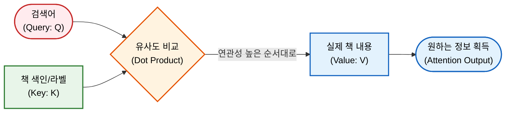
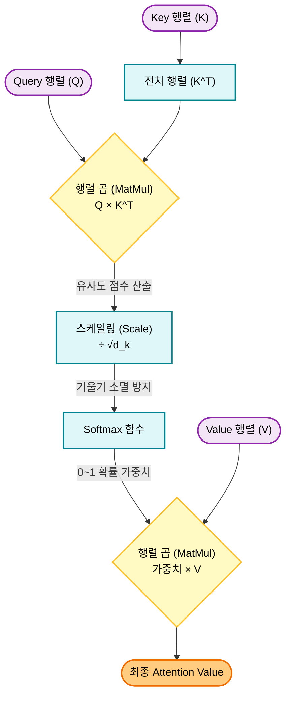
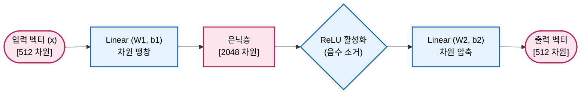
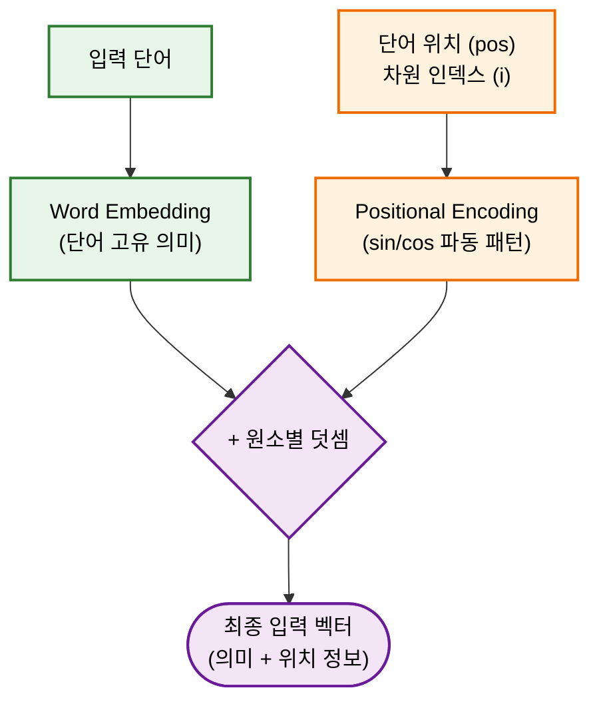

Transformer 모델 구조의 핵심 개념과 수학적 원리를 담은 글이다.

<!-- truncate -->

## 1. Transformer의 등장 배경

기존 NLP 처리 분야에서 주류를 이루던 모델은 RNN(Recurrent Neural Network)과 LSTM(Long Short-Term Memory)이었다. 이 모델들은 데이터를 순차적(Sequential)으로 처리한다. 예를 들어 "나는 학교에 간다"라는 문장이 있을 때, '나는'을 처리한 결과를 바탕으로 '학교에'를 처리하고, 그 결과를 다시 바탕으로 '간다'를 처리하는 방식이다.

이러한 순차적 처리 방식에는 두 가지 치명적인 한계가 있다.

1. **parallel하게 처리 불가:** 이전 단어의 연산이 끝나야만 다음 단어의 연산을 수행할 수 있으므로, 컴퓨터의 연산 자원을 동시에 활용하는 parallel 처리가 불가능하다.

2. **장기 의존성(Long-term Dependency) 문제:** 문장이 길어질수록 초반에 입력된 단어의 정보가 뒤로 갈수록 희미해지는 현상이 발생한다.

Transformer는 "**단어들을 순차적으로 넣지 말고, 문장 전체를 한꺼번에 입력한 뒤 단어들 간의 관계를 동시에 계산하자**"는 아이디어에서 출발했다. 이를 가능하게 한 핵심 기술이 바로 **Attention** 메커니즘이다.

## 2. Model Architecture

Transformer는 기계 번역과 같은 Sequence Transduction 작업에 최적화된 **Encoder-Decoder** 구조를 채택하고 있다.

import TransformerBlockDiagram from '@site/src/components/diagrams/TransformerBlockDiagram';

<TransformerBlockDiagram />

* **Auto-regressive 특성:** 모델은 출력을 생성할 때 이전에 자신이 생성한 출력 기호들을 다음 단계의 추가 입력으로 사용한다. 즉, 1번째 단어를 예측하고, 그 단어를 포함하여 2번째 단어를 예측하는 방식이다.

### 2.1 Encoder

Encoder는 입력된 원본 문장(예: 한국어 문장)을 읽고, 그 문장 내 단어들의 의미와 문맥을 파악하여 압축된 정보(Representation)로 변환하는 역할을 한다.

* **계층 구조:** 총 $N = 6$개의 Identical layers 를 쌓아 올린 형태이다.

* **Sub-layer:** 각 레이어는 내부적으로 2개의 Sub-layer를 가진다.

  1. **Multi-Head Self-Attention:** 문장 내부의 단어들이 서로 어떤 연관성을 가지는지 파악한다.

  2. **Position-wise Feed-Forward Network (FFN):** 파악된 연관성 정보를 바탕으로 각 단어의 특징을 더욱 깊게 학습하는 Neural Network이다.

* **Residual Connection 및 Layer Normalization:**
  각 Sub-layer의 출력은 다음과 같은 수식으로 처리된다.

  $$
  Output = LayerNorm(x + Sublayer(x))
  $$

  * $x$**:** Sub-layer로 들어가는 원본 입력값이다.

  * $Sublayer(x)$**:** Attention이나 FFN 연산을 거친 결과값이다.

  * $x + Sublayer(x)$ **(Residual Connection):** 연산 결과에 원본 입력값을 더해준다. 층이 깊어지더라도 초기 정보가 소실되는 것을 방지하여 학습을 안정적으로 만든다.

  * $LayerNorm(...)$**:** 더해진 결과값의 평균과 분산을 구하여 데이터를 일정한 범위로 정규화한다.

* **차원 통일:** Residual Connection을 원활하게 수행하기 위해, 모델 내부의 모든 Sub-layer와 Embedding 층의 출력 차원은 $d_{model} = 512$로 고정된다.

### 2.2 Decoder

Decoder는 Encoder가 압축해 놓은 문맥 정보를 바탕으로 타겟 문장(예: 번역된 영어 문장)을 하나씩 생성하는 역할을 한다. Encoder와 마찬가지로 $N = 6$개의 동일한 레이어로 구성되지만, Sub-layer가 3개로 늘어난다.

1. **Masked Multi-Head Self-Attention:**

   * Decoder가 출력 단어를 생성할 때, 현재 위치보다 뒤에 있는(미래의) 단어들을 미리 보지 못하게 가리는(Masking) 역할을 한다.

   * 예를 들어 3번째 단어를 예측할 때는 1, 2번째 단어만 참조할 수 있도록, 미래 단어들의 유사도 점수(Score)를 $-\infty$로 마스킹하여, Softmax 함수를 거친 후의 Attention 가중치(Weight)가 0이 되도록 만든다.

2. **Multi-Head Attention (Encoder-Decoder Attention):**

   * Decoder가 단어를 생성하기 위해 "원본 문장의 어떤 부분을 집중해서 봐야 할지"를 결정하는 곳이다.

   * 여기서 Decoder는 자신의 정보를 기준(Query)으로 삼고, Encoder가 최종적으로 출력한 정보(Key, Value)를 참조한다.

3. **Position-wise Feed-Forward Network:** Encoder의 구조와 동일하다.

## 3. Attention 메커니즘

Attention 메커니즘은 Transformer의 핵심이다. Attention 함수는 하나의 Query와 Key-Value 쌍들의 집합을 출력에 매핑하는 작업으로 설명할 수 있다.

비유하자면 도서관에서 정보를 찾는 과정과 같다.

* **Query (Q):** 사용자가 검색창에 입력한 '검색어' (현재 파악하고자 하는 대상 단어)

* **Key (K):** 도서관 책들에 붙어있는 '색인' 또는 '라벨' (다른 단어들이 가진 특징)

* **Value (V):** 그 책의 실제 '내용' (다른 단어들이 가진 실제 정보)

(* Self-Attention의 경우 $Q, K, V$는 모두 같은 입력 문장으로부터 생성되며, 각각 서로 다른 가중치 행렬을 곱해 목적에 맞게 변환된 값이다)

### 3.1 Scaled Dot-Product Attention

논문에서는 Attention을 계산하기 위해 'Scaled Dot-Product Attention'이라는 방식을 제안한다. 연산 수식은 다음과 같다.

$$
Attention(Q, K, V) = softmax(\frac{QK^T}{\sqrt{d_k}})V
$$

* $Q$ **(Query Matrix):** | [질문] | 타겟 단어들의 벡터가 모인 Matrix이다.

* $K$ **(Key Matrix):** | [위치] | 참조할 단어들의 벡터가 모인 Matrix이다.

* $V$ **(Value Matrix):** | [내용] | 참조할 단어들의 실제 정보 벡터가 모인 Matrix이다.

* $K^T$**:** Key Matrix의 전치 Matrix(Transposed Matrix)이다. Matrix 곱을 위해 행과 열을 바꾼 형태이다.

* $d_k$**:** Query와 Key 벡터의 차원 수이다. (논문에서는 $d_k = 64$를 사용한다.)

* $\sqrt{d_k}$**:** $d_k$의 제곱근이다. (논문에서는 $\sqrt{64} = 8$이 된다.)

* $softmax$**:** 입력된 값들을 0과 1 사이의 확률값으로 변환하고, 그 총합이 1이 되도록 만드는 함수이다. (공식: $\frac{e^{x_i}}{\sum e^{x_j}}$)
---

$$
Attention(Q, K, V) = softmax(\frac{QK^T}{\sqrt{d_k}})V
$$

1. $QK^T$ **(유사도 계산):** Query 행렬과 Key 전치 행렬을 행렬 곱(Matrix Multiplication)한다. 이는 Query 단어 벡터와 각 Key 단어 벡터 간의 내적(Dot Product)을 한 번에 계산하는 과정으로, Query 단어와 각 key 단어가 얼마나 연관성이 높은지(유사한지)를 수학적인 점수로 산출하는 과정이다. 값이 클수록 두 단어의 연관성이 높다는 뜻이다.

2. $\frac{QK^T}{\sqrt{d_k}}$ **(Scaling):** Dot product을 수행하면 차원 수($d_k$)가 클수록 결과값이 매우 커지는 경향이 있다. 값이 너무 커지면 다음 단계인 Softmax 함수에서 기울기(Gradient)가 0에 수렴하여 학습이 진행되지 않는 문제가 발생한다. 이를 방지하기 위해 점수를 $\sqrt{d_k}$로 나누어 값의 크기를 적절하게 조절(Scaling)한다.

3. $softmax(...)$ **(weight 확률화):** Scaling 된 점수들을 Softmax 함수에 통과시킨다. 이 과정을 거치면 각 단어에 대한 점수가 0~1 사이의 확률값(weight)으로 변환된다. 예를 들어 "0.9"가 나오면 이 단어와 매우 강하게 연관되어 있다는 뜻이고, "0.01"이 나오면 거의 무시해도 좋다는 뜻이다.

4. $\times V$ **(정보의 결합):** 계산된 Softmax weight를 실제 정보인 Value Matrix에 곱한다. 결과적으로 연관성이 높은 단어의 정보(Value)는 많이 가져오고, 연관성이 낮은 단어의 정보는 적게 가져와서 하나로 합치게 된다. 이 결과가 바로 Attention의 최종 출력값이 된다.

### 3.2 Multi-Head Attention

Transformer는 위의 단일 Attention을 한 번만 수행하지 않고, 차원을 여러 개로 쪼개어 여러 번의 Attention을 parallel하게 수행한다. 이를 Multi-Head Attention이라고 부른다.

import MultiHeadAttentionDiagram from '@site/src/components/diagrams/MultiHeadAttentionDiagram';

<MultiHeadAttentionDiagram />

논문에서는 $d_{model} = 512$차원을 $h = 8$개의 Head로 쪼갠다. 따라서 각 Head는 $d_k = d_v = 512 / 8 = 64$ 차원의 벡터를 다루게 된다.

**왜 Multi Head(여러개)를 사용하는가?**

문장 내에서 단어들의 관계는 다각도로 해석될 수 있다.
예를 들어 "그가 강하게 공을 찼다"라는 문장에서 '찼다'라는 단어는 '그가'(주어, 누가 했는가?)와 연결될 수도 있고, '공을'(목적어, 무엇을 했는가?)과 연결될 수도 있다.
단일 Attention만 사용하면 여러 관계 중 평균적인 한 가지 관점만 보게 되지만, Head를 8개로 나누면 각각의 Head가 주어와의 관계, 목적어와의 관계, 시제와의 관계 등 서로 다른 다양한 문맥적 특징(Representation subspace)을 동시에 포착할 수 있다.

각각의 Head에서 계산된 8개의 결과 Matrix은 마지막에 하나로 이어 붙여진(Concatenated) 후, 선형 변환(Linear Projection) Matrix을 곱하여 최종 출력 Matrix이 된다.

## 4. Position-wise Feed-Forward Network

Attention Sub-layer를 통과한 데이터는 각 레이어마다 포함된 완전 연결 전방향 신경망(Fully Connected Feed-Forward Network, FFN)을 거치게 된다.  

"Position-wise"라는 의미는 문장을 구성하는 개별 단어 위치(Position)마다 동일한 Neural Network가 각각 독립적으로 적용된다는 뜻이다.

$$
FFN(x) = \max(0, xW_1 + b_1)W_2 + b_2
$$

* $x$**:** Attention 층을 통과하여 들어온 입력 벡터이다. 차원은 $d_{model} = 512$이다.

* $W_1, b_1$**:** 첫 번째 선형 변환을 위한 weight(Weight) Matrix과 편향(Bias) 벡터이다.

* $\max(0, ...)$**:** ReLU(Rectified Linear Unit) 활성화 함수이다. 괄호 안의 계산 결과가 0보다 작으면 0으로 만들고, 0보다 크면 그 값을 그대로 유지한다. 비선형성을 부여하는 핵심 요소이다.

* $W_2, b_2$**:** 두 번째 선형 변환을 위한 weight Matrix과 편향 벡터이다.

이 신경망은 샌드위치 구조를 가진다.

1. **차원 확장:** 입력 벡터 $x$ (512차원)에 weight $W_1$을 곱하여 차원을 $d_{ff} = 2048$ 차원으로 크게 확장시킨다.

2. **활성화:** 확장된 공간에서 ReLU 함수를 거치며 데이터의 비선형적 특징을 추출한다. 이 과정에서 불필요한 정보(음수 값)는 0으로 소거된다.

3. **차원 압축:** 다시 weight $W_2$를 곱하여 원래의 차원인 $d_{model} = 512$ 차원으로 압축하여 출력한다.

Attention 이 단어들 사이의 '관계'를 수집하는 과정이라면, FFN 층은 수집된 정보를 바탕으로 각 단어 자체가 가진 '의미'를 더욱 복잡하고 풍부하게 가공하여 기억하는 역할을 담당한다. 모델 전체의 학습 파라미터(weight) 대부분이 바로 이 FFN의 $W_1, W_2$ Matrix에 집중되어 있다.

## 5. Positional Encoding

Transformer는 RNN 구조를 버리고 Matrix 곱셈을 통한 parallel 처리를 택했다. 그러나 이로 인해 치명적인 단점이 생긴다. Attention 연산은 단어 집합을 마치 순서가 없는 '가방(Bag of words)'처럼 취급하기 때문에, "나는 밥을 먹는다"와 "밥을 나는 먹는다"를 수학적으로 동일하게 인식할 수 있다.

이를 해결하기 위해 모델이 Sequence 내 단어의 상대적 또는 절대적 '위치(순서)' 정보를 알 수 있도록, 입력 단어의 Embedding 벡터에 위치 정보를 담은 벡터를 더해주는 과정을 **Positional Encoding**이라고 한다.

논문에서는 위치 정보를 생성하기 위해 다양한 주파수를 가진 사인(Sine) 및 코사인(Cosine) 함수를 사용한다.

$$
PE_{(pos, 2i)} = \sin(pos / 10000^{2i/d_{model}})
$$

$$
PE_{(pos, 2i+1)} = \cos(pos / 10000^{2i/d_{model}})
$$

* $pos$**:** 문장 내에서 해당 단어의 위치(Position) 인덱스이다. (예: 첫 번째 단어는 0, 두 번째 단어는 1)

* $i$**:** 차원(Dimension)의 인덱스이다. Embedding 벡터 내의 몇 번째 값인지를 나타낸다.  
$i$의 범위는 $0$부터 $d_{model}/2 - 1$까지이며, 이를 통해 벡터의 짝수 인덱스($2i$)와 홀수 인덱스($2i+1$)에 각각 다른 삼각함수를 짝지어 적용한다

* $2_{i}, 2_{i+1}$**:** 벡터의 인덱스가 짝수(2i)일 때는 사인(sin) 함수를, 홀수(2i+1)일 때는 코사인(cos) 함수를 사용한다는 의미이다.

* $d_{model}$**:** Embedding 벡터의 총 차원 수 (512)이다.

* $10000^{2i/d_{model}}$**:** 주파수를 결정하는 분모 항목이다. 인덱스 $i$가 커질수록 분모가 커져 주파수가 매우 느리게 변하게 된다.

 이 공식을 사용하면 문장 내의 각 위치(pos)마다, 그리고 벡터의 각 차원(i)마다 고유한 패턴을 가지는 연속적인 실수 값이 생성된다. 삼각함수를 사용했기 때문에 위치 Vector의 값들은 -1에서 1 사이의 값으로 일정하게 파동을 그린다.

이렇게 수학적 규칙으로 생성된 512 dimension의 '위치 벡터'를, 데이터가 Encoder나 Decoder의 첫 번째 레이어에 들어가기 직전에 원래 단어의 'Embedding 벡터'에 단순 덧셈(+)해 준다. 결과적으로 모델은 학습을 진행하면서 단어의 고유한 의미뿐만 아니라, 이 삼각함수 파동 패턴을 역추적해서 "아, 이 단어는 문장의 앞부분에 있구나" 혹은 "저 단어는 바로 다음 위치에 있구나"라는 상대적인 순서(relative position)를 파악할 수 있게 된다.
